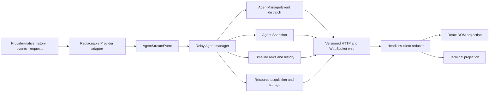
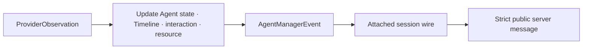
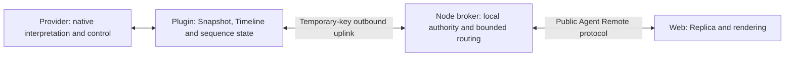
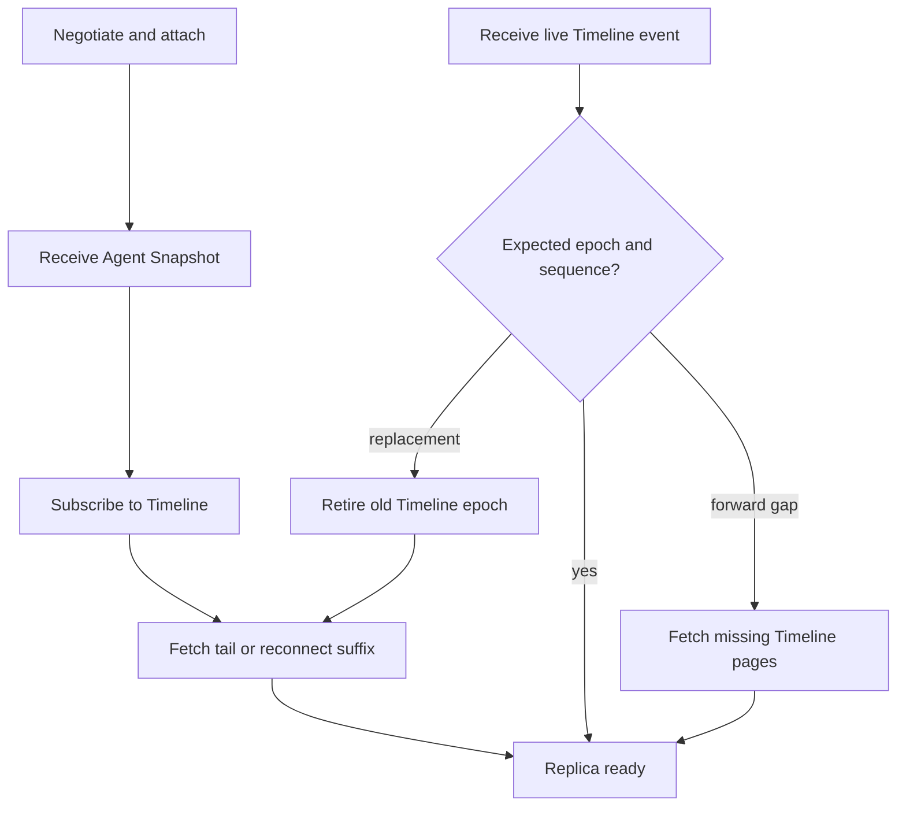

# Agent Remote Observation — Normalized Events, Owner Control, and Web Projection

## Purpose

Agent Remote Control exposes an Agent runtime through a replaceable Provider boundary. Each Provider converts native history, live notifications, interactions, and resources into a common contract. The Relay owns remote session state and transport, while Web and terminal clients reconstruct public state without understanding the native runtime.

## Local Control Authority

The standalone workbench has no user accounts. Browser operations are limited to the loopback host and configured application origin. Provider capabilities describe supported controls; the server enforces the request boundary before dispatch.

A locally generated temporary key authenticates a DSH installation's outbound Remote Host uplink. The broker retains only its digest, binds it to the first installation identity, and returns the secret only at creation. Keys, hosts, and session bindings live in the current server process. Key expiration rejects new uplink connections; an established connection continues until it disconnects or the workbench stops.

The native installation retains credentials, workspace ownership, and session persistence. Public session identifiers are opaque bindings to a Host and native session. They do not imply collaboration accounts or messaging permissions.

Host reconnection reattaches known native sessions on demand before public reads or streams resume. Uncertain session-creation outcomes remain associated with their original request identity and are never automatically repeated.

## Design Principles

- Provider-native event names, request shapes, and process lifecycle stop at the Provider adapter.
- `AgentStreamEvent` describes normalized runtime facts and Timeline items rather than UI components.
- `AgentManagerEvent` is an internal Relay dispatch type, not a public wire union.
- Agent Snapshot, Timeline history, live Timeline delivery, interactions, and resources remain separate protocol concerns.
- The client reducer owns recovery and projection into UI-ready state.
- Message and reasoning bodies are strings; tool calls, tasks, interactions, and resource state use dedicated structures.
- Generated files move through the resource relay and do not require a rich-message content tree.
- The reusable renderer targets React DOM and remains independent of any Provider runtime.
- The Lab and debugger exercise the serialized public boundary rather than sharing Relay state in memory.
- Authorization is evaluated before capability and request dispatch. Client rendering remains a usability boundary, while server enforcement is authoritative.

## System Shape



Replacing one Provider with another does not require a Relay, protocol, reducer, or renderer change when both adapters satisfy the same declared capabilities.

## Package Boundaries

Each row names one independently reusable component.

| Component | Responsibility | Excluded responsibility |
| --- | --- | --- |
| `@borgee/agent-provider-sdk` | Provider descriptors, session lifecycle, capabilities, normalized events, Timeline item types, typed interactions, command descriptors, persistence handles, and resource reads. | Native SDK implementations, public wire encoding, Relay storage, UI, or product authorization. |
| `@borgee/agent-provider-dsh` | DSH session ownership, history and live handoff, native event projection, interaction mapping, and authorized generated-resource reads. | Relay transport, public history projection, UI, or authority decisions. |
| `@borgee/agent-provider-codex` | Codex app-server transport, session ownership, history and live handoff, native projection, and typed interaction mapping. | Relay transport, public history projection, UI, or authority decisions. |
| `@borgee/agent-remote-protocol` | Strict versioned public requests, responses, Snapshot, Timeline pages, interactions, resource messages, and runtime codecs. | Native event interpretation, Provider process ownership, UI, or deciding Agent ownership. |
| `@borgee/agent-remote-relay` | Provider registry, session ownership, current state, Timeline storage and projection, resource acquisition, manager dispatch, and HTTP and WebSocket transport. | Provider-native interpretation, presentation, or substituting capabilities for product authorization. |
| `@borgee/agent-remote-web` | Public-wire transport, recoverable headless replica, deterministic reducer, selectors, and React DOM components. | Provider sessions, Relay-internal dispatch, product layout, or authoritative access control. |
| `@borgee/agent-remote-debugger` | Command-line operation and observation through the shared headless client. | A second reducer, direct Provider access, or bypassing Owner authorization. |
| `agent-remote-lab` | Loopback-only composition of Providers, Relay, Workbench, public trace, and protocol inspector. | Production authorization, durable storage, or product navigation. |

## Provider Contract

A Provider owns all native runtime integration and exposes one common adapter and session shape:

```ts
interface AgentProviderAdapter {
  readonly descriptor: AgentProviderDescriptor;
  createSession(config: AgentSessionConfig): Promise<AgentSession>;
  resumeSession(handle: AgentPersistenceHandle): Promise<AgentSession>;
}

interface AgentSession {
  readonly capabilities: AgentCapabilities;
  observe(): AsyncIterable<ProviderStreamItem>;
  sendMessage(text: string): Promise<void>;
  respondToInteraction(requestId: string, response: AgentInteractionResponse): Promise<void>;
  steer?(text: string): Promise<void>;
  cancel?(): Promise<void>;
  setPlanning?(active: boolean): Promise<void>;
  setSessionSetting?(id: string, value: string): Promise<void>;
  listCommands?(): Promise<AgentCommand[]>;
  executeCommand?(id: string, args: string): Promise<AgentCommandResult>;
  readResource?(locator: string): Promise<AgentResourceReadResult>;
  runtimeInfo(): Promise<AgentRuntimeInfo>;
  dispose(): Promise<void>;
}
```

`ProviderStreamItem` is a `ProviderObservation` or the single `history_boundary` marker. An observation carries a stable source key, occurrence time, history or live delivery classification, an optional native revision, one `AgentStreamEvent`, and optional Provider-private resource references.

The adapter begins native live observation before history hydration, emits historical observations, emits one boundary, and then drains buffered and subsequent live observations. The Relay rejects history after the boundary and does not declare the session ready before receiving it.

Capabilities state which optional controls, interactions, history, and resource reads the concrete session supports. Generic clients enable Owner behavior from these capabilities only after authorization, not from a Provider name. Session disposal is idempotent resource release regardless of whether creation, attachment, or observation later fails.

Direct Provider-session message submission, interaction response, steer, and cancel remain explicit control operations admitted by the local server and checked against Provider capabilities.

Planning is an optional session workflow control, independent of permissions and plan approval capability. Creation may select planning, and an idle session with no pending interaction may change it through an acknowledged public command. Unsupported or busy sessions reject the command. Providers report the effective planning state and any requested future target through runtime information; a command acknowledgement alone does not establish that the requested state is effective. Provider-native changes also update the reported state. Planning does not establish a write sandbox.

Session model and permission controls use Provider-declared selection descriptors in `runtimeInfo.settings`. Each descriptor declares an opaque ID and value, a display label, available choices, mutability, and whether the native write affects the current session or also the default for future sessions. A single `set_session_setting` command selects one advertised value. It never accepts arbitrary native RPC parameters. Relay validates the latest Provider choices and serializes setting writes with message submission; only idle sessions without active turns or pending interactions admit a change. Confirmed values arrive through existing runtime updates and snapshots, without new Timeline activity or a settings-specific response channel.

Chat slash commands come from the concrete Provider session through optional `commands` capability and `listCommands()` / `executeCommand(id, args)` operations. Each descriptor contains an opaque `id`, slash-free `name`, `description`, `kind` (`command`, `skill`, or `prompt`), and optional `inputHint`. The composer discovers this directory when its menu opens, filters names, preserves arguments, and sends only a selected Provider command. Unknown or unavailable commands remain local errors. Toolbar model, permission, and status controls remain independent shortcuts; the client does not invent a fixed slash directory.

The public wire uses `list_commands` → `command_list` and `execute_command` → `command_result`, correlated by `requestId` and `agentId`, without an additional command acknowledgement for either pair. A result may contain text or may be empty when the Provider has opened an interaction. Multi-step native menus reuse existing `question` / `form` requests and interaction responses. The initial command result does not imply that those later selections have completed. Providers own native translation, validation, and continuations; the Relay keeps the interaction-response path available while a command is pending.

Codex discovers enabled skills for the current working directory and custom prompts from its configured home, alongside explicit model, permissions, and compact adapters. Skills use native skill input; model selection may lead to a reasoning-effort question, permission selection preserves native requirement constraints, and setting changes require native confirmation. Prompt expansion supports raw `$ARGUMENTS`; unsupported named, positional, escaped-dollar, or braced placeholders fail explicitly. DSH discovers the agent-scoped native command registry on demand and executes registered commands through that registry. Its model selector is adapted only when no native model command exists, and exposes the native side effect of saving the default for future sessions. Neither Provider directory claims terminal menu scraping or full TUI command parity.


## Normalized Event Model

`AgentStreamEvent` covers thread and turn lifecycle, Timeline items, usage, runtime state, typed interaction requests, and typed interaction resolutions. Timeline items cover user messages, assistant messages, reasoning, tool calls, todo state, completed interactions, errors, and compaction.

User, assistant, and reasoning items carry string bodies. Incremental native output becomes multiple Timeline rows with stable Provider source identity. The Relay projection may merge compatible adjacent assistant or reasoning rows, collapse tool lifecycle rows by call identity, and replace todo state within the same turn. The projection retains contributing sequence ranges for replay and pagination.

Unknown native notifications with no independent remote meaning may be consumed by the Provider. A native event whose unsupported meaning must remain visible becomes a normalized error item or fails the Provider observation stream. Transport metadata, telemetry, and bookkeeping do not become Timeline errors merely because they have no public representation.

## Typed Interactions

Question, plan approval, and tool approval are closed request and response unions. Questions define identifiers, labels, prompts, selection rules, options, custom text, dismissal, and required state. Plan approvals define the plan text and allowed actions. Tool approvals define the tool identity, typed detail, allowed decisions, and available approval scopes.

The Relay tracks pending requests independently of the Timeline. A response reaches the Provider only while the matching request remains pending, and duplicate concurrent responses cannot both claim the same request. Public request and response messages repeat the interaction identity so the client can correlate acknowledgement and state removal.

Plan rejection may carry written revision feedback. The Provider maps the decision and feedback to native planning behavior and owns any continuation after approval or revision; the renderer never sends a second continuation message. Approval feedback is invalid unless an explicit future contract defines its meaning.

A matching normalized interaction resolution appends one read-only Timeline record containing the complete request and response. The Relay derives this record from normalized interaction data without interpreting Provider-native values. Unmatched resolutions do not invent missing request content, and repeated observations do not duplicate history. Pending forms express only current actionable requests; resolved records survive browser refresh through ordinary Timeline recovery. Recovery from a terminated native process depends on Provider persistence and is not implied by browser recovery.

Interaction responses and approvals pass through the same local-origin, Host-binding, and Provider-capability boundaries as message submission.

## Control Authorization and Dispatch

Every management operation carries an exact session target. The standalone server checks the local request origin and session binding before forwarding to the native Host. Temporary pairing keys authenticate only outbound Host connections.

Authorization failure is terminal for that request and dispatches no Provider mutation. Capability checks and typed protocol responses remain authoritative after admission.

## Relay State and Dispatch

The Relay owns Provider session attachment, current Agent state, ordered Timeline rows, Timeline projection, resource acquisition, and public transport. A `ProviderObservation` updates the relevant state and then produces the corresponding internal `AgentManagerEvent`:



The dispatch union distinguishes Agent state, normalized stream activity, Timeline replacement, Timeline resource-binding replacement, resource updates, interaction requests, and interaction resolutions. Session transport maps only declared dispatch values to declared public messages; the internal union never crosses the wire directly.

The Relay validates all public messages against strict runtime schemas and requires exact protocol-version negotiation before resolving or subscribing to an Agent. Bounded handoff queues cover events racing Snapshot delivery and Timeline subscription acknowledgement. Overflow closes the affected connection rather than silently dropping state.

### Content-stateless Host composition

The Node broker retains live connections, bounded request routing, and in-memory native-session bindings. The DSH plugin initiates the connection and supplies the authoritative session projection. The TypeScript session engine stays in the plugin; the plugin opens no public Relay listener.



The broker forwards public payloads without assigning Timeline epochs, constructing Snapshots, or caching conversation content. Plugin reconnect restores native bindings on demand. Pending creation requests and message mutations are never automatically replayed.

The direct Node Relay and outbound Host composition exercise the same production Web transport, session client, and Replica in conformance tests.

### Personal discovery and native lifecycle

The personal Remote directory combines currently loaded top-level sessions, including idle and blank sessions, with ordinary persisted sessions indexed by each paired DSH Host. It uses lightweight native headers and available cached metadata without hydrating transcripts, restoring Agents, or attaching a Provider while listing. Subagent sessions are excluded; ordinary forks remain discoverable.

Catalog pages sort by native update time descending, falling back to creation time and breaking ties by stable native identity. A bounded, expiring read view fixes membership and ordering during traversal. A disposed session becomes unavailable in that view; expiry requires an explicit refresh. The Node broker forwards admitted pages without storing the catalog. The browser retains loaded pages and reading position, renders a bounded row window, and offers Updates available when fresh activity changes the ordering.

Opening a session borrows its live native Agent or asks DSH's session controller to restore an existing persisted session on demand before borrowing it. A missing session remains unavailable instead of being recreated. Creating one uses DSH's Host-owned session API, default model, and optional registered workspace. Each creation intent reserves stable native and public identities before dispatch. An explicit retry reuses those identities and original parameters, including after creation succeeds but workspace association fails. Discovery and creation never provision a collaboration Agent automatically.

Remote detach and credential revocation release observers without disposing borrowed native Agents. Native disposal is tracked by exact Agent instance so callbacks from an old instance cannot affect its replacement. A surviving Plugin retains its projection and epoch across uplink reconnect; a rebuilt projection requires a fresh epoch and full client recovery.

## Snapshot, Timeline, and Replay

`AgentSnapshot` is the current non-Timeline recovery point. Its full Agent Owner projection contains Agent identity, Provider identity, lifecycle state, active turn, capabilities, pending interactions, runtime information, persistence information when available, latest usage, and latest error. A non-owner observer receives a separately authorized redacted projection that omits host details, logs, management configuration, credentials, and reusable control material. Timeline entries are not embedded in the Snapshot.

Timeline is an independently paged and subscribed sequence. Relay-owned rows receive one epoch and a monotonic sequence. A public Timeline entry may represent one row or a projection of several rows and therefore carries its first and last sequence plus every contributing sequence range.



Backward pagination selects projected entries by their first contributing sequence. Forward pagination first bounds a raw sequence window and then projects it, so one merged entry cannot hide unseen rows. A stale epoch returns an explicit reset, while a cursor ahead of recoverable history returns an explicit gap.

Duplicate sequences leave the replica unchanged. Authoritative pages replace overlapping live projections, and events from a retired epoch cannot mutate current state. Snapshot replacement preserves the independently reconstructed Timeline. Interaction changes newer than the Snapshot request baseline remain authoritative when that Snapshot arrives.

## Resource Relay

A Provider may associate a Timeline observation with opaque resource locators and separate read locators. The Relay converts these private references into public bindings, acquires authorized bytes through the Provider session, stores them behind a Relay resource identity, and publishes pending, available, failed, or unavailable state.

The public Timeline carries only visible locators, Relay resource identities, and lifecycle state. A client requests bytes separately by Agent and resource identity; available responses carry media type, length, digest, and encoded content. Provider read identities never enter the public protocol.

Resource access is narrower than workspace file access. Each Provider decides which native result created an eligible locator, and the Relay decides whether a remote request may read the acquired resource. Product storage may persist acquired bytes beyond the Provider process lifetime without changing Timeline semantics.

Reading a resource is governed by observation and resource policy. A resource authority may revoke that read path, while revocation creates no right to control the producing Agent. Resource content is never treated as an Agent management credential.

## Web Client and Renderer

The Web package separates transport, session synchronization, replica reduction, and presentation. Its headless entry has no React dependency and is shared by the browser and terminal debugger.

The client subscribes before catch-up, buffers only uninitialized or forward-gapped live rows, follows advancing pages until no newer history remains, and reconnects through a generation guard when recovery fails. Correlated command, interaction, and resource operations complete only from their matching public responses.

React DOM components render the reconstructed Timeline and typed interactions from replica state and callbacks. They do not open Provider connections, interpret native values, decide product layout, or authorize a command. Resource content is never executed by the baseline renderer.

The workbench disables mutation controls while disconnected and presents only controls supported by the selected Provider. Hiding controls does not replace server validation.

Question forms retain stable question identifiers and structured selected values. Multi-question navigation preserves answer drafts while moving between questions or console views, marks answered questions, and locks submission until the matching operation settles. Completed question and plan records remain read-only. Normal conversation and planning controls stay primary in the Lab, with public protocol and Replica diagnostics available as secondary views.

## Validation Surfaces

The Lab is a loopback-only protocol Workbench. It composes replaceable Providers through one Relay, renders the shared React DOM Timeline, exposes current Agent state and typed interaction forms, and shows public replica and protocol diagnostics. A deterministic Recorded Provider validates protocol behavior without a native runtime, while DSH and Codex compositions validate real Provider boundaries.

The chat composer shows current runtime activity and the active turn's elapsed wall time, including time spent waiting for an interaction. Elapsed time uses the start timestamp from the Snapshot or live event envelope, survives browser recovery, and remains unavailable when the source timestamp is unknown. Native turn timestamps take precedence over notification receipt time when supplied. A disconnected view does not present retained activity as live.

Interrupt forwards the existing cancel operation to the native Provider. It requires a synchronized connection, cancel capability, and either an active turn or a native command currently pending in the composer. The request preserves the message draft and remains distinct from native completion: acknowledgement does not change the Agent to idle, and the control suppresses repeated interrupts for that turn until the native state changes. Runtime activity is presentation of existing state, not an additional Timeline event or execution mechanism.

The Lab may use an explicit synthetic Owner identity to exercise commands, but it does not establish production authority. Its observer mode remains read-only. Product code cannot reuse loopback assumptions as an authorization decision.

The debugger provides equivalent operation and observation through commands suitable for automation. It uses the same public transport, session client, and replica as the browser; it does not duplicate synchronization or projection logic. Against a product deployment, debugger control commands require the same authenticated Agent Owner as browser controls.

## Failure Semantics

- A Provider observation iterator that fails or finishes unexpectedly changes the Agent to failed state and produces a Provider diagnostic.
- A malformed public client message produces a strict protocol error and cannot reach Provider control code.
- An unauthorized management request is rejected before Provider, Helper, configuration, or Agent-side binding work and cannot be represented as success.
- A disconnected client retains its current replica and resumes from Timeline history when possible.
- Closing only DSH Web leaves its Host, Plugin, and native sessions running. Host process exit, Plugin stop, or a missed transport heartbeat marks the Host offline and retires its pending requests and browser streams.
- An offline personal conversation retains loaded history, drafts, and reading position while disabling commands, interaction responses, and resource acquisition until authoritative synchronization finishes.
- A mutation interrupted after dispatch has an uncertain outcome. The client reports that uncertainty and never resends it automatically; an explicit creation retry retains its reserved identity.
- Transient uplink failures reconnect with bounded backoff. Rejected or revoked credentials stop retries until reconfigured. A restarted DSH Host exposes its live and ordinary persisted-session catalog, restoring a persisted session only when opened; an absent native session remains unavailable and is never silently recreated.
- A non-advancing or cross-epoch recovery cursor triggers bounded resynchronization rather than an infinite recovery loop.
- An unavailable capability or stale interaction response is rejected and cannot be represented as success.
- A failed resource read remains a typed resource state and does not corrupt its Timeline entry.
- Resource-access revocation ends subsequent reads or use of that resource without changing Agent ownership or granting the revoker Agent controls.

## Verification

Each verification layer proves a distinct contract.

| Layer | Evidence |
| --- | --- |
| Provider SDK | Session lifecycle, single history boundary, capability consistency, history and live ordering, failure propagation, and disposal. |
| Provider projection | Native fixtures produce the expected Timeline, lifecycle, usage, interaction, and resource observations. |
| Public protocol | Strict runtime encoding and decoding, exact version negotiation, Timeline pagination, interactions, resources, and malformed-message rejection. |
| Local authorization | Wrong browser origins, missing or expired pairing keys, foreign installation identities, and unknown session bindings fail before dispatch. |
| Pairing and directory | Scoped keys, isolated Hosts and sessions, revocation, stable newest-first pagination, native creation idempotency, and borrowed native lifetime hold across disconnect and reconnect. |
| Relay | Provider observations converge on independent Agent state, Timeline history, manager dispatch, and resource state. |
| Client reducer | Duplicate delivery, live and history races, gaps, reconnect, epoch replacement, Snapshot replacement, and correlated operations converge. |
| Web components | Timeline items, interaction forms, resource states, capability-gated controls, disconnected states, responsive behavior, and accessibility render from replica state. |
| End to end | Recorded, DSH, and Codex flows cross serialized HTTP and WebSocket boundaries; Host conformance includes pairing, catalog, creation, attachment, reconnect, and chat. |

Deterministic package and Recorded Provider tests are suitable for continuous validation. Native runtime flows require compatible local executables, fixtures or credentials, and bounded test timeouts.

## Product Integration Boundary

The standalone Relay contract can be implemented by a product service without moving Provider interpretation into that service. Product integration owns Agent ownership verification, Agent-to-channel binding, resource access enforcement, durable Timeline and resource storage, retention, and deployment topology. The Lab and debugger do not decide those bindings or production authority.

The resource side may revoke its own access grant. Only the Agent Owner may select a different resource, restore an Agent-side binding, or change the Agent in response.

## Non-Goals

- Treating UI components as the Provider event contract.
- Embedding Timeline rows inside Agent Snapshot.
- Exposing Provider-native events or Relay-internal dispatch values on the public wire.
- Granting arbitrary workspace file access through a resource binding.
- Requiring the Lab layout for embedding product surfaces.
- Claiming lossless preservation of every native Provider field when it has no supported cross-provider meaning.
- Defining retention or multi-node deployment in the validation packages.
- Letting a product role, resource role, protocol capability, Provider, Helper, or observer act as the Agent Owner.

## Composer message delivery

Ordinary send means immediate input: start work when idle, or supplement active work through native steering. The Provider resolves the state at delivery time. A separate busy-state action requests next-turn delivery only when the Provider exposes a native follow-up queue. Remote does not manufacture a queue for an adapter whose native API lacks it. Explicit next-turn intent remains next-turn intent when the current turn ends during submission. Native acceptance, pending input, and consumed input are distinct states; a send acknowledgement does not assert consumption. Only definite native non-delivery may permit a safe fallback, while uncertain failures retain the draft and do not automatically resubmit.
