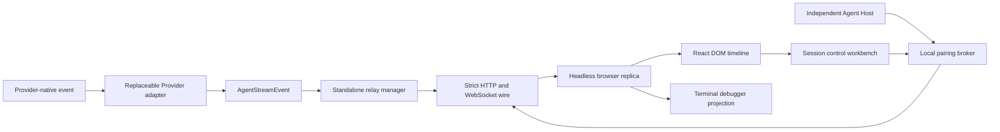
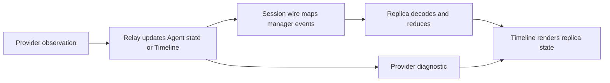

# Agent Remote — Independent Session Control and Protocol Workbench

## Role

Agent Remote is the independent session-control and validation boundary that carries replaceable Provider observations through strict public wire messages into a recoverable browser replica and reusable React DOM timeline (`packages/agent-provider-sdk/src/observation.ts:59-108`, `packages/agent-remote-protocol/src/messages.ts:150-176`).

## Boundary

This area covers `@agent-remote-controller/agent-provider-sdk`, the DSH, Codex and Claude adapters, `@agent-remote-controller/agent-remote-controller`, `@agent-remote-controller/agent-remote-protocol`, `@agent-remote-controller/agent-remote-relay`, `@agent-remote-controller/agent-remote-web`, `@agent-remote-controller/agent-remote-debugger`, `@agent-remote-controller/dsh`, and `agent-remote-lab`; Provider-native values end at the adapters and `AgentManagerEvent` remains Relay-internal (`packages/agent-remote-relay/src/agent-manager-events.ts:14-39`, `packages/agent-remote-debugger/src/runtime.ts:62-102`).

The Agent Host owns native Provider directories, runtime lifetime, and outbound uplink replacement. The DSH runtime owns its native catalog and outbound plugin. The Lab production server owns only the Recorded fixture, pairing broker, and public-protocol workbench; temporary Host keys and public bindings have no account or Borgee service dependency (`packages/agent-host/src/host.ts`, `packages/agent-remote-lab/src/server/local.ts`, `packages/agent-remote-lab/src/server/remote-host-broker.ts`).

## Collaborators

| Module | Direction | Responsibility |
| --- | --- | --- |
| Provider adapters | Provider adapters → Agent Remote | Normalize native observations to `AgentStreamEvent` and declare session capabilities. |
| Protocol package | Protocol package → Agent Remote | Defines strict versioned public request, response, snapshot, Timeline, interaction, and resource messages. |
| Product surfaces | Agent Remote → Product surfaces | Offers a pure React DOM timeline without selecting a product layout (`packages/agent-remote-web/src/react/AgentTimeline.tsx:21-70`). |
| Agent Host | Agent Host → Local broker | Registers one or more Provider descriptors, serves native directories, and carries public session traffic over an outbound uplink. |
| Terminal automation | Agent Remote → Terminal automation | Offers the same reconstructed public state and correlated operations through a CLI projection (`packages/agent-remote-debugger/src/commands.ts:148-267`). |

## Internal Architecture

The relay owns current Agent state, canonical Timeline rows, and resource ingestion; the Web package owns browser reconstruction; the lab composes public boundaries and routes paired Hosts without interpreting their public conversation content (`packages/agent-remote-relay/src/agent-manager.ts:97-115`, `packages/agent-remote-relay/src/timeline-store.ts:29-68`).

## Key Flows

## Invariants

- The browser renderer has no provider-native or Relay-internal dependency (`packages/agent-remote-web/src/headless.ts:1-7`, `packages/agent-remote-web/src/react/AgentTimeline.tsx:1-18`).
- Snapshot holds current Agent state and pending interactions, while Timeline history is fetched and recovered separately (`packages/agent-remote-protocol/src/snapshot.ts:47-72`, `packages/agent-remote-protocol/src/history.ts:13-48`).
- The lab observes the public serialized boundary rather than shared in-memory event objects (`packages/agent-remote-lab/src/server.ts:11-23`).
- Declared capabilities, rather than Provider names, decide whether a generic Lab control is enabled (`packages/agent-remote-lab/src/components/LiveControlPanel.tsx:15-66`).

## Non-Goals

- This area does not bind agent sessions to Borgee channels, durable product storage, or product authorization.
- The Lab does not contain a Provider projector or duplicate the Web reducer or renderer: its Node entry only composes supplied Providers with Relay, while its shell imports the shared Replica/client and Timeline components (`packages/agent-remote-lab/src/server.ts:1-23`, `packages/agent-remote-lab/src/App.tsx:10-23`, `packages/agent-remote-lab/src/components/LabWorkbench.tsx:1-34`).

## See also

- [Relay](relay.md) — relay ownership and transport composition.
- [Web](web.md) — client reconstruction and reusable rendering boundary.
- [Lab](lab.md) — standalone validation-site composition.

## Subdocuments

| Document | Use it for |
| --- | --- |
| [relay.md](relay.md) | Relay session ownership and serialized transport. |
| [protocol.md](protocol.md) | Versioned public wire and separate Snapshot/Timeline recovery contract. |
| [providers.md](providers.md) | Replaceable SDK, DSH, Codex and Claude Provider boundaries. |
| [provider-support.md](provider-support.md) | Audited capability matrix, endpoint support and workaround boundaries. |
| [provider-onboarding.md](provider-onboarding.md) | Comparison record and acceptance checklist for a new Provider. |
| [claude-support-audit.md](claude-support-audit.md) | Claude coverage, explicit gaps and verification against the baseline. |
| [web.md](web.md) | Headless recovery and React DOM presentation. |
| [debugger.md](debugger.md) | Terminal presentation over the shared headless client. |
| [lab.md](lab.md) | The workbench, temporary Host pairing, discovery, creation, and protocol validation. |
| [host-vscode-tunnel.md](host-vscode-tunnel.md) | Host-owned VS Code process lifetime, device authorization, resource reclamation, and workspace links. |

## Implementation Anchors

- `packages/agent-provider-sdk/src/observation.ts:59-108`
- `packages/agent-remote-protocol/src/messages.ts:150-176`
- `packages/agent-remote-relay/src/agent-manager.ts:250-380`
- `packages/agent-remote-web/src/client/remote-session-client.ts:126-225`
- `packages/agent-remote-debugger/src/runtime.ts:62-159`
- `packages/agent-remote-lab/src/server.ts:11-23`

- `packages/agent-remote-dsh/src/agent-remote.ts:1`
- `packages/agent-remote-lab/src/server/remote-host-broker.ts:20`
- `packages/agent-remote-lab/src/server/session-directory.ts:16`

Provider feasibility and delivery order: [Paseo comparison and gap ledger](provider-gap-analysis.md).

- [Session connection diagnostics](session-recovery-errors.md): error boundaries, recovery behavior, and Controller log fields.
