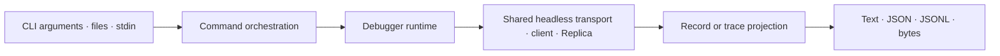
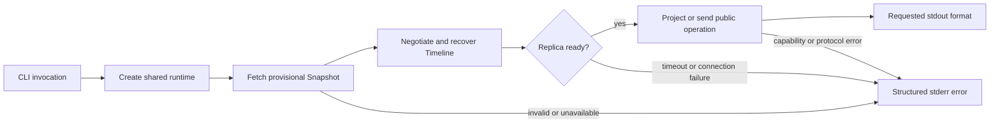

# Debugger — Terminal Public-Wire Projection

## Role

`@borgee/agent-remote-debugger` is a terminal presentation adapter that drives and observes an Agent Remote Relay through the shared headless client rather than becoming another protocol implementation (`packages/agent-remote-debugger/src/runtime.ts:65-173`).

## Boundary

The package owns CLI parsing, command orchestration, Replica-to-record projection, one command cancellation/deadline signal, output streams, atomic local resource output, process interruption, and exit categories; `@borgee/agent-remote-web/headless` owns public-wire decoding, synchronization, correlation, and Replica reduction (`packages/agent-remote-debugger/src/cli.ts:18-117`, `packages/agent-remote-debugger/src/commands.ts:32-94`, `packages/agent-remote-debugger/src/output.ts:59-76`, `packages/agent-remote-debugger/src/records.ts:31-120`).

## Collaborators

| Module | Direction | Responsibility |
| --- | --- | --- |
| Remote relay | Relay → Debugger | Supplies only public HTTP and WebSocket protocol values to the shared transport. |
| Web headless client | Web → Debugger | Provides transport, session synchronization, operation correlation, and the reconstructed Replica. |
| Remote protocol | Remote protocol → Debugger | Defines the validated public messages passed through commands and trace records. |
| Shell automation | Debugger → Shell automation | Receives requested data on stdout and operational diagnostics or errors on stderr. |

## Internal Architecture

The runtime instantiates `HttpWebSocketTransport`, `RemoteSessionClient`, and `AgentReplica`; record projection observes Replica changes but does not own Replica state (`packages/agent-remote-debugger/src/runtime.ts:65-173`, `packages/agent-remote-debugger/src/records.ts:31-71`).

## Key Flows

## Invariants

- A command requiring a session completes setup only after the shared client reports ready; capability validation happens against that reconstructed Snapshot before the command writes a public client message (`packages/agent-remote-debugger/src/commands.ts:326-352`, `packages/agent-remote-debugger/src/runtime.ts:287-302`).
- An explicit timeout and SIGINT feed one cancellation signal through input, Snapshot preflight, runtime lifecycle, acknowledgement, and later waiting; an unbounded stream is possible only when the invocation omits its timeout (`packages/agent-remote-debugger/src/commands.ts:63-94`, `packages/agent-remote-debugger/src/commands.ts:326-348`, `packages/agent-remote-debugger/src/commands.ts:468-533`, `packages/agent-remote-debugger/src/runtime.ts:102-110`, `packages/agent-remote-debugger/src/runtime.ts:146-157`).
- `observe` emits its baseline only when the client reaches ready, suppresses structurally equal Replica values, and expresses a same-epoch authoritative deletion as a Timeline reset with the current rows and checkpoint (`packages/agent-remote-debugger/src/records.ts:37-71`, `packages/agent-remote-debugger/src/records.ts:89-120`, `packages/agent-remote-debugger/src/structural.ts:1-14`).
- Send, steer, cancel, interaction response, and resource retrieval wait for the matching shared-client protocol result rather than treating a socket write as success (`packages/agent-remote-debugger/src/commands.ts:148-227`, `packages/agent-remote-web/src/client/remote-session-client.ts:102-153`).
- Planning selection uses the same capability-checked shared-client command path; session creation carries an explicit planning preference to the Relay rather than silently changing permissions (`packages/agent-remote-debugger/src/commands.ts:106-116`, `packages/agent-remote-debugger/src/commands.ts:196-203`, `packages/agent-remote-debugger/src/commands.ts:556-569`).
- The protocol trace observes validated public messages with direction and channel, forwards preflight validation diagnostics without fabricating a protocol record, and replaces available resource content with a byte-length and digest marker (`packages/agent-remote-debugger/src/commands.ts:273-301`, `packages/agent-remote-debugger/src/runtime.ts:83-110`, `packages/agent-remote-debugger/src/runtime.ts:176-188`, `packages/agent-remote-debugger/src/runtime.ts:323-334`).
- JSON and JSONL writers use stdout only for requested data, while structured errors and resource metadata use stderr; binary stdout requires explicit `--output -`, and file resources replace their destination only after a complete temporary write (`packages/agent-remote-debugger/src/output.ts:18-76`, `packages/agent-remote-debugger/src/commands.ts:229-255`, `packages/agent-remote-debugger/src/commands.ts:441-467`).

## Non-Goals

- The debugger does not connect directly to DSH, Codex, or another Provider runtime; its runtime imports public protocol values and the Web headless boundary, while Provider-specific attachment access remains in the DSH Provider runtime (`packages/agent-remote-debugger/src/runtime.ts:1-13`, `packages/agent-provider-dsh/src/live-session.ts:174-177`).
- The debugger does not retain Provider-native events, logs, or a separate Timeline reducer; trace observes transport-decoded public messages and record projection subscribes to the shared Replica (`packages/agent-remote-debugger/src/runtime.ts:145-148`, `packages/agent-remote-debugger/src/records.ts:29-69`).
- The debugger does not provide an interactive shell, daemon, or product layout; process entry invokes the command layer and returns an exit category (`packages/agent-remote-debugger/src/cli.ts:18-37`, `packages/agent-remote-debugger/src/cli.ts:136-138`).

## See also

- [Agent Remote](README.md) — the protocol-validation boundary that contains this terminal adapter.
- [Web](web.md) — the shared headless client, Replica, and React DOM presentation boundary.
- [Protocol](protocol.md) — versioned public messages observed and issued by the debugger.
- [Relay](relay.md) — authoritative session state and the public HTTP/WebSocket boundary.
- [Providers](providers.md) — the point where Provider-native events, including DSH attachments, end.

## Implementation Anchors

- `packages/agent-remote-debugger/package.json:1-34`
- `packages/agent-remote-debugger/src/cli.ts:12-138`
- `packages/agent-remote-debugger/src/commands.ts:32-594`
- `packages/agent-remote-debugger/src/runtime.ts:65-334`
- `packages/agent-remote-debugger/src/records.ts:31-174`
- `packages/agent-remote-debugger/src/output.ts:9-93`

The standalone connection resolves explicit options before `AGENT_REMOTE_URL` and `AGENT_REMOTE_ORIGIN`, then the compatible `BORGEE_REMOTE_*` environment names, then local defaults (`packages/agent-remote-debugger/src/input.ts:10`).
