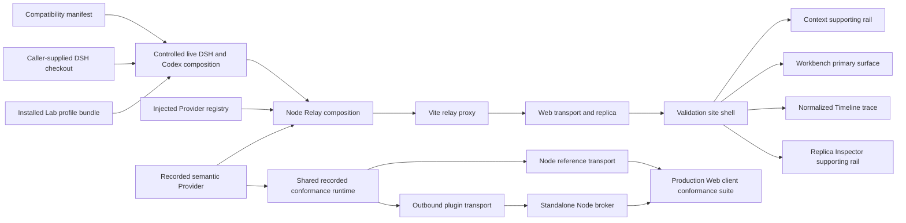
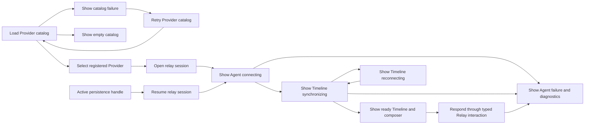

# Lab — Standalone Protocol Validation Site

## Role

`agent-remote-lab` is a private Vite site whose production launcher operates the deterministic Recorded Provider and routes native Providers from paired Agent Hosts. Test-only compositions inspect the real Codex app-server against deterministic Responses and controlled live DSH through the Relay public API and reusable Web package (`packages/agent-remote-lab/src/server/local.ts`, `packages/agent-remote-lab/scripts/codex-host-fixture.ts`, `packages/agent-remote-lab/src/server/live-plugin.ts`).

## Boundary

The package owns the standalone site shell, generic Node Relay composition, declared-scope compatibility identity and Provider-matrix validation, and validation-only Recorded/Codex/live-DSH assembly. Provider packages retain native projection and runtime ownership; the caller retains the compatible DSH installation or checkout and credentials (`packages/agent-remote-lab/src/server.ts:6-23`, `packages/agent-remote-lab/src/server/compatibility.ts:122-247`, `packages/agent-remote-lab/src/server/installed-dsh-plugin.ts:16`).

## Collaborators

| Module | Direction | Responsibility |
| --- | --- | --- |
| Relay public API | Lab → Relay | Composes the standalone HTTP/WebSocket server without Relay internals (`packages/agent-remote-lab/src/server.ts:1-23`). |
| Web package | Web → Lab | Supplies HTTP/WebSocket transport, replica, session client, and public Timeline (`packages/agent-remote-lab/src/App.tsx:69-125`). |
| Injected Provider adapters | Provider adapter → Lab | Supplies only explicitly configured validation Providers (`packages/agent-remote-lab/src/server.ts:6-15`). |
| Recorded Provider | Lab → Recorded Provider | Supplies deterministic Timeline, interaction, replacement, and resource scenarios (`packages/agent-remote-lab/src/server/recorded.ts:37-123`). |
| Codex Agent Host fixture | Test harness → Agent Host | Runs the real app-server against deterministic local Responses in a process separate from the Lab backend and identifies the fixture in the Host catalog (`packages/agent-remote-lab/scripts/codex-host-fixture.ts`, `packages/agent-remote-lab/src/server/codex.ts`). |
| DSH source checkout | Live launcher → DSH | Loads the compiled validation plugin through a caller-supplied compatible runtime (`packages/agent-remote-lab/scripts/run-live-dsh.sh:76-205`). |
| DSH Web profile | Profile bundle → DSH | Loads the packaged validation adapter into the existing native Web host and shares its services (`packages/agent-remote-lab/src/server/installed-dsh-plugin.ts:9`, `packages/agent-remote-lab/scripts/build-dsh-plugin.ts:57`). |

## Internal Architecture

The shell keeps Workbench mounted because its Timeline, composer, and interaction state are the primary work surface. Context and the initially collapsed Replica Inspector are supporting rails, while Trace is a separate normalized projection over the same replica (`packages/agent-remote-lab/src/App.tsx:117-136`, `packages/agent-remote-lab/src/App.tsx:271-406`, `packages/agent-remote-lab/src/components/LabWorkbench.tsx:20-85`, `packages/agent-remote-lab/src/components/SupportingRail.tsx:31-89`).

The Lab supplies its conversation layout and callback wiring; shared Web components own command drafts, planning controls, scroll anchoring, and semantic Timeline rendering (`packages/agent-remote-lab/src/components/LabWorkbench.tsx:20-82`, `packages/agent-remote-web/src/react/useTimelineScroll.ts:5`, `packages/agent-remote-web/src/react/AgentComposer.tsx:21`).

The app header and desktop Context rail can be hidden independently. A View menu stays at the top-left on desktop and top-right in compact layouts and contains Header, Sidebar, and Replica Inspector visibility checkboxes. Show all selects every panel on desktop; Hide all clears the panel selection in any layout. Compact layouts open one supporting drawer at a time. Desktop headings reserve its space without adding a toolbar row. Drafts and the active view remain mounted. Compact supporting rails keep their focus-managed dialog behavior and return focus to the Sessions or View control that opened them.

The conversation header shares one row with its parent path and a collapsed Sessions popover. Connection identifiers and reconnect live in the app-bar disclosure. The composer contains its message field and a single wrapping toolbar; model and permission settings open above it, while detailed status and planning appear under Status. Working time and interrupt remain visible during active operations. Popovers do not resize the Timeline (`packages/agent-remote-lab/src/components/LabWorkbench.tsx`, `packages/agent-remote-lab/src/components/ChatSessionManager.tsx`, `packages/agent-remote-lab/src/app.css`).

Conversation styling gives adjacent tool, reasoning, and compaction entries compact spacing while preserving message and interaction-card reading space. The shared disclosures retain keyboard controls, and coarse-pointer layouts retain larger touch targets (`packages/agent-remote-lab/src/app.css:410-449`, `packages/agent-remote-lab/src/app.css:582-598`).

## Key Flows

## Invariants

- Provider catalog loading, an empty catalog, and a failed catalog request remain visibly distinct; retry reloads the catalog, while session creation requires a selected registered Provider and resume requires an active persistence handle (`packages/agent-remote-lab/src/App.tsx:97-115`, `packages/agent-remote-lab/src/components/ProviderSessionControls.tsx:19-35`).
- The Node composition accepts a Provider array once, then constructs one Relay and one public HTTP/WebSocket server (`packages/agent-remote-lab/src/server.ts:6-23`).
- Conformance mutations execute once against one runtime; both public routes retain identical Agent identity, epochs, sequence ranges, timestamps, and resource bindings. Recovery comparisons use matching browser lifecycles, with a continuously connected observer checking content continuity (`packages/agent-remote-lab/src/server/relay-conformance.test.ts:45`, `packages/agent-remote-lab/src/server/relay-conformance.test.ts:124`).
- Capabilities determine whether controls are available; the compatibility manifest states the exact DSH and Codex degradations used by the live composition. Known DSH plugin, skill-catalog, and agent-instructions context is consumed, unknown injected sources become visible Timeline errors, and Codex metadata or command side-channel events remain without a public state carrier (`packages/agent-remote-lab/compatibility.json:28-94`, `packages/agent-provider-dsh/src/projector.ts:138-147`, `packages/agent-provider-codex/src/projector.ts:24-43`).
- Compatibility validation requires the exact Provider/degradation set and a matching SHA-256 identity for the declared scope. Sorted file paths and exact bytes include root workspace, package, and lockfile metadata; packaging-only or version-only changes in that scope require revalidation before live composition even when Agent Remote runtime code is unchanged (`packages/agent-remote-lab/compatibility.json:11-35`, `packages/agent-remote-lab/src/server/compatibility.ts:7-25`, `packages/agent-remote-lab/src/server/compatibility.ts:158-247`).
- Recorded-only scenario controls are same-origin POST seams; ordinary session work remains on public Relay routes (`packages/agent-remote-lab/src/server/recorded.ts:322-356`).
- Workbench and Trace are presentation modes over one replica, but only Workbench carries the primary Timeline, draft, and pending interaction surface; changing modes or opening a supporting rail cannot replace that state (`packages/agent-remote-lab/src/App.tsx:117-136`, `packages/agent-remote-lab/src/App.tsx:223-247`, `packages/agent-remote-lab/src/App.tsx:367-390`, `packages/agent-remote-lab/src/components/LabWorkbench.tsx:20-85`).
- Conversation scrolling follows growth until explicit upward navigation, scrollbar movement, focus navigation to an earlier control, or history loading pauses it; browser-driven position changes preserve following. Reading mode keeps the visible entry and offset through history prepends and layout changes. Hidden Workbench updates preserve reading intent, while Agent or epoch replacement resumes latest following (`packages/agent-remote-web/src/react/useTimelineScroll.ts:5`, `packages/agent-remote-lab/src/components/LabWorkbench.tsx:20-21`, `packages/agent-remote-lab/src/App.tsx:370-380`).
- Session creation may explicitly request planning without inferring support from Provider identity; creation rejection remains visible and does not attach a substitute ordinary session (`packages/agent-remote-lab/src/App.tsx:198`, `packages/agent-remote-lab/src/components/ProviderSessionControls.tsx:29`).
- Planning changes require a connected idle Agent with no active turn or pending interaction and a declared capability. The displayed mode follows Provider runtime state, while a command acknowledgement alone leaves the control waiting for confirmation (`packages/agent-remote-web/src/react/AgentPlanningControl.tsx:11`).
- Question drafts belong to the Lab session and request, outside the shared question card. Switching inspection views or remounting a card retains the stable-ID answer map; resolved request and response history belongs to the Relay Timeline rather than local form state (`packages/agent-remote-lab/src/App.tsx:87`, `packages/agent-remote-lab/src/App.tsx:387`, `packages/agent-remote-web/src/react/items/InteractionItem.tsx:9`).
- Composer drafts and pending commands belong to an Agent; successful immediate-send or native-queue confirmation clears only the submitted draft, rejection preserves it, and cancel leaves it intact. A completion for another Agent cannot redirect focus or replace the current draft (`packages/agent-remote-web/src/react/AgentComposer.tsx:21`).
- Lab controls await the shared client's correlated completion before reporting success, retain pending interactions/resources until Replica state changes, and present rejected confirmations as failures. Enter submission excludes newlines and active input-method composition (`packages/agent-remote-lab/src/App.tsx:253-264`, `packages/agent-remote-web/src/react/AgentComposer.tsx:21`, `packages/agent-remote-web/src/react/InteractionPanel.tsx:16-30`, `packages/agent-remote-web/src/react/ResourceList.tsx:17-37`).
- Public diagnostics and normalized Timeline projection remain distinct from Provider-native and raw-wire data (`packages/agent-remote-lab/src/components/TraceView.tsx:4-28`, `packages/agent-remote-lab/src/components/ReplicaInspector.tsx:17-50`).
- On compact layouts, Context and Replica Inspector are focus-contained sheets with internal close controls, Escape dismissal, and focus return to their triggering control; scenario-command feedback remains in the active supporting rail, and conversation-command feedback stays in the composer (`packages/agent-remote-lab/src/App.tsx:171-185`, `packages/agent-remote-lab/src/App.tsx:316-365`, `packages/agent-remote-lab/src/components/SupportingRail.tsx:31-90`, `packages/agent-remote-lab/src/components/RecordedPlaybackControls.tsx:9-26`, `packages/agent-remote-web/src/react/AgentComposer.tsx:21`).
- Ordinary standalone DSH creation leaves native plan state untouched. Setting `BORGEE_LIVE_DSH_PLAN_MODE=1` selects the standalone plan-approval fixture and seeds planning only for new sessions, while resume preserves the stored state; the browser approval suite selects that fixture at launch (`packages/agent-remote-lab/src/server/live-plugin.ts:50-86`, `packages/agent-remote-lab/src/server/live-plugin.ts:141-149`, `packages/agent-remote-lab/playwright.config.ts:5-10`).
- `AGENT_REMOTE_DSH_DELIVERY_FIXTURE=1` launches a headless DSH process with a temporary home, a controlled LLM adapter, no initial plan mode, and no Codex fixture. Browser delivery tests inspect native Inbox and turn events to distinguish same-turn steering from queued follow-up consumption and verify interruption. This path requires only the common Agent services; the installed shared-Web plugin separately declares its Web service dependencies (`packages/agent-remote-lab/scripts/dsh-delivery-fixture.mjs:1`, `packages/agent-remote-lab/e2e/dsh-delivery.spec.ts:1`, `packages/agent-remote-lab/src/server/installed-dsh-plugin.ts:9`).
- The live plugin supports `runtimeMode: shared-web` through the host's native model and preset services. Agent setup installs the host's default model selection before mounting the native preset; resume restores the latest recorded preset before the Relay receives that session (`packages/agent-remote-lab/src/server/live-plugin.ts:56-63`, `packages/agent-remote-dsh/src/shared-web-session.ts:20-42`).
- Shared Web mode uses DSH's native model selection and rejects explicit Lab model or reasoning-effort overrides. A successful native request header updates the public runtime model through its safe model field; clicking the Web selector alone does not refresh the Lab runtime model (`packages/agent-remote-lab/src/server/live-plugin.ts:58-61`, `packages/agent-remote-lab/src/server/live-plugin.ts:120-125`, `packages/agent-provider-dsh/src/projector.ts:113-126`).
- Shared Web interactions use the host's native interaction services so either client can answer the same pending request. The plugin creates the shared adapter before its Provider and releases Relay sessions before disposing the adapter (`packages/agent-remote-lab/src/server/live-plugin.ts:42`, `packages/agent-remote-lab/src/server/live-plugin.ts:46-57`, `packages/agent-provider-dsh/src/web-interactions.ts:57-65`).
- Live Lab instances select loopback-only Relay and Web ports with `BORGEE_LIVE_DSH_RELAY_PORT` and `BORGEE_LIVE_DSH_WEB_PORT`, defaulting to `5910` and `6175`. The configured Web origin is shared by Relay authorization and fixture controls (`packages/agent-remote-lab/src/server/live-plugin.ts:48-49`, `packages/agent-remote-lab/src/server/live-plugin.ts:201-229`, `packages/agent-remote-lab/src/server/live-plugin.ts:244-253`).
- The live launcher requires an explicit absolute DSH checkout, validates its pinned version/revision before pnpm or Cordis startup, inherits credentials without inspecting them, and confines plugin output plus session persistence to launcher-owned temporary directories (`packages/agent-remote-lab/scripts/run-live-dsh.sh:65-117`, `packages/agent-remote-lab/scripts/run-live-dsh.sh:127-205`).
- The installable Lab profile bundle inlines Borgee adapters and Relay code while leaving native DSH packages as host-supplied peers. Its embedded compatibility manifest verifies the packed artifact independently of the source checkout, and activation rejects mismatched native Agent, LLM, or Session versions (`packages/agent-remote-lab/scripts/build-dsh-plugin.ts:18`, `packages/agent-remote-lab/src/server/installed-dsh-plugin.ts:27`).
- The packaged adapter joins the native Web host in shared mode and registers DSH without requiring the optional Codex fixture; standalone live validation retains its explicit Codex executable requirement (`packages/agent-remote-lab/src/server/installed-dsh-plugin.ts:23`, `packages/agent-remote-lab/src/server/live-plugin.ts:47`).
- Release preparation resolves the published native dependency and peer graph into one exact-version npm override set, keeping compatible installation independent of a DSH source checkout (`packages/agent-remote-lab/scripts/prepare-dsh-release.ts:28`).

## Non-Goals

- The Lab composes validation adapters but does not own DSH/Codex projection, native protocol semantics, native credential configuration, or durable account storage (`packages/agent-remote-lab/src/server.ts:1-23`, `packages/agent-remote-lab/src/server/live-plugin.ts:74-96`).
- The live composition does not discover credentials, promise deterministic model output, or claim a complete Provider control plane (`packages/agent-remote-lab/scripts/run-live-dsh.sh:65-117`, `packages/agent-remote-lab/compatibility.json:28-94`).
- The live composition does not replace the recorded browser specifications as the repeatable validation gate (`packages/agent-remote-lab/e2e/recorded.spec.ts:4-62`, `packages/agent-remote-lab/e2e/live-dsh.spec.ts:14-77`).
- The Lab does not report unsupported controls as successful operations (`packages/agent-remote-web/src/react/AgentComposer.tsx:21`).
- The Lab does not replace the Relay protocol decoder, headless reducer, or React DOM renderer (`packages/agent-remote-lab/src/components/LabWorkbench.tsx:1-9`, `packages/agent-remote-lab/src/components/LabWorkbench.tsx:52-62`).

## See also

- [Agent Remote](README.md) — package boundary and documentation map.
- [Providers](providers.md) — native adapters whose capabilities bound Lab controls.
- [Protocol](protocol.md) — strict public messages inspected by the Lab.
- [Relay](relay.md) — remote session owner composed by the Node entry.
- [Web](web.md) — recoverable client and shared renderer used by the shell.

## Implementation Anchors

- `packages/agent-remote-lab/src/server.ts:6-23`
- `packages/agent-remote-lab/src/server/recorded.ts:315-369`
- `packages/agent-remote-lab/src/server/standalone-conformance.test.ts:8`
- `packages/agent-remote-lab/src/server/remote-host-broker.test.ts:73`
- `packages/agent-remote-lab/scripts/run-relay-conformance.mjs:10`
- `packages/agent-remote-lab/src/server/codex.ts:30-72`
- `packages/agent-remote-lab/src/server/live-plugin.ts:19-199`
- `packages/agent-remote-lab/src/server/compatibility.ts:7-247`
- `packages/agent-remote-lab/scripts/run-live-dsh.sh:65-205`
- `packages/agent-remote-lab/scripts/build-dsh-plugin.ts:18`
- `packages/agent-remote-lab/scripts/prepare-dsh-release.ts:28`
- `packages/agent-remote-lab/src/server/installed-dsh-plugin.ts:16`
- `packages/agent-remote-lab/src/App.tsx:70-406`
- `packages/agent-remote-lab/src/components/LabWorkbench.tsx:20-85`
- `packages/agent-remote-web/src/react/AgentComposer.tsx:21`
- `packages/agent-remote-web/src/react/AgentPlanningControl.tsx:11`
- `packages/agent-remote-web/src/react/useTimelineScroll.ts:5`
- `packages/agent-remote-lab/src/components/ReplicaInspector.tsx:3-61`
- `packages/agent-remote-lab/src/components/SupportingRail.tsx:31-105`
- `packages/agent-remote-lab/src/components/TraceView.tsx:4-54`
- `packages/agent-remote-lab/e2e/recorded.spec.ts:4-130`
- `packages/agent-remote-lab/e2e/modernization.spec.ts:8-190`
- `packages/agent-remote-lab/playwright.config.ts:5-40`

## Standalone Host Control

The Node broker owns temporary pairing keys, installation discovery, catalog forwarding, and opaque native-session bindings. Agent Host and DSH connect outbound through the shared Remote Host uplink; public Snapshot, Timeline, and browser streams retain their existing protocol (`packages/agent-remote-lab/src/server/remote-host-broker.ts`).

A reconnect advances the host connection generation and restores native bindings on demand before reading or streaming. Creation request identities remain in memory and uncertain creation outcomes are not replayed (`packages/agent-remote-lab/src/server/remote-host-broker.ts:118`).

The workbench presents host pairing, provider session discovery, workspace selection, creation, and connection alongside conversation and protocol inspection (`packages/agent-remote-lab/src/App.tsx:1`, `packages/agent-remote-lab/src/server/session-directory.ts:16`).

## Interaction acceptance fixture

The opt-in `AGENT_REMOTE_TEST_INTERACTIONS=1` Playwright mode launches a deterministic Provider for typed forms, permissions, external actions, policy approvals, and sensitive form answers. Desktop and mobile tests use the real HTTP/WebSocket workbench pipeline, verify history and reconnect, and save screenshots under the ignored package `.tmp/interaction-capabilities` directory. This is fixture-backed acceptance; native Codex mapping and real CLI transport have separate tests (`packages/agent-remote-lab/src/server/interactions.ts`, `packages/agent-remote-lab/e2e/interaction-capabilities.spec.ts`).

## Native child chat navigation

`POST /v1/remote/child/attach` accepts `providerId`, `parentNativeSessionId`, and `nativeSessionId`. The local directory requires an attached parent whose current Snapshot contains the requested direct child, then calls the source's optional `openChild` method. The Codex source delegates to its existing runtime. Concurrent attachment reuses one Remote Agent, and children remain excluded from the root catalog. Sources without native child attachment return an explicit unavailable response (`packages/agent-remote-lab/src/server/session-directory.ts`, `packages/agent-remote-lab/src/server/codex-directory.ts`).

Selecting a child preserves the parent's draft and opens the child's existing chat. Navigation releases no native runtime. Parent navigation remains available, and the normal composer uses the child's actual capability snapshot.

Opened sessions and Discover sessions render a shared hierarchy with groups collapsed by default keyed by Host, Provider, and native session identity. Catalog roots retain activity order; runtime-discovered children use creation order and stable discovery order for ties. Discovery includes known children before they are opened, without requesting another native runtime. Missing catalog pages or closed parent views retain ancestor rows. Closing an opened row removes only that view's directory entry.

The chat Sessions component starts collapsed and reveals the current session family when opened, including parent and sibling navigation, native status summaries, and saved-history availability. Relationship observations are retained while switching chats; only the active chat has a client subscription, so inactive family status reflects its last received observation until refreshed through the parent or child. Drafts and native control capabilities remain scoped to each chat. No additional Remote protocol fields or lifecycle actions are introduced (`packages/agent-remote-lab/src/session-tree.ts`, `packages/agent-remote-lab/src/hooks/useSessionEntries.ts`, `packages/agent-remote-lab/src/components/ChatSessionManager.tsx`).

The directory-backed Resume action reattaches the existing native session instead of creating a duplicate runtime. Child views disable generic Resume and retain the parent attachment path. Direct debugger-created sessions must first be opened through the directory before using its child attachment route.

The conversation layout keeps long session paths on one line and uses compact message spacing. The composer grows with its draft; narrow layouts keep command, setting and send controls in one row with touch-sized targets, while active turn status and Interrupt occupy a separate row. The header starts collapsed and can be expanded from the persistent View menu. Connection status remains readable in the expanded phone header. Session groups stay collapsed until explicitly expanded, including when their active child changes.

Compact workbenches track the browser's Visual Viewport height and offset so the composer and scrollable supporting drawers remain inside the keyboard-visible area. Pinch zoom preserves the existing layout dimensions. Composer growth and popup height are bounded by available viewport height. Drawers use a sticky title and close control; narrow inputs use 16 px text. At widths up to 1,180 px, side conversations use one full-width chat viewport. The Side path selector navigates the selected route; each conversation retains its own side list. Collapsed window strips remain a desktop presentation. The Back control returns to the source, preserving mounted conversations and drafts. Desktop retains its simultaneous conversations. Browser regression covers contracted viewport events and portrait/landscape layouts; it does not substitute for physical iOS/Android keyboard acceptance.

The workbench requests 100 projected Timeline entries per page and prefetches older history as the reader approaches the loaded beginning. Manual loading remains available, shares the prefetch request, and exposes pending or failed history independently of the live connection. Prepending keeps the latest visible entry offset, including when the reader keeps moving during the request or new live activity arrives.

## Context forks and side conversations

The console supplies `/fork` and `/side` independently of Provider command discovery; `/btw` aliases `/side`. Fork creates an independent native session from normalized conversation context, leaving the source chat open and adding an entry above its composer. Side opens that session beside the source; command arguments become its first user input. The side view owns a separate RemoteSessionClient, replica, composer, history reader and interaction state. Closing it stops observation without closing the native runtime. Narrow screens show the side conversation in place of the still-mounted primary view.

`session-forks.ts` captures a single Timeline projection with a 20,000-entry bound and curates user messages, assistant messages and tool calls/results. One response keeps long-running tool updates in the same snapshot; its canonical window supplies the boundary. Incomplete responses fail instead of combining independently changing pages. Reasoning, diagnostics and interaction responses are excluded. Incomplete captures fail explicitly. User and assistant messages remain intact without a console character limit. Tool detail fields use 400-character excerpts, combined results use 1,200-character excerpts and errors use 600-character excerpts; excerpts retain both ends and mark omitted characters. The source reference and quoted attachment disclose how many tool records were shortened. Browser storage, transport and native context limits still apply. This is a snapshot of available normalized history, not a native `thread/fork` or a full native context export. The quoted attachment travels in the first normal message or skill/prompt argument; no system prompt, runtime scheduler or public protocol field is added. The renderer removes only the exact recorded attachment text; Trace retains actual native input.

A permanent `& Source` tag with a fork badge identifies the source native session, capture time and cursor. It opens source details and navigation. Browser-local fork records survive opened-session removal and page reload, separately from the opened-session list. The ledger retains context, creation request identity, destination native identity and first-input delivery state. A confirmed retry of the same uncertain first input does not send it again. Unknown delivery is not automatically replayed. Browser storage is required for creating forks; native session retention still depends on the Provider. Fork provenance does not populate native subagent parent fields.

Creation inherits session-scoped mutable settings through existing Provider controls. DSH Hosts resolve the source working directory to a registered workspace and retain native global defaults. Codex Hosts preserve the source working directory, model, planning state, and mutable session settings. Fork settings are initialized before the first input; later explicit changes belong to the new session.

## Mobile session shell

Compact layouts expose Sessions directly. The full-screen session panel starts with the Host selector and a search over loaded sessions. Matching descendants keep ancestor context and expand during search. Browse provider changes the catalog without exposing creation settings. New session opens Provider/workspace/model configuration; Settings contains Host pairing, revocation, account sign-out, and recorded playback controls. Session selection closes the panel and resumes the conversation.

Session and side navigation replace the current URL rather than adding browser history entries. Overscroll containment reduces scroll chaining and supported navigation gestures. The application does not trap browser history or promise to disable native iOS edge navigation. A normal browser fills its available visual viewport; the install manifest supports a standalone Home Screen launch without browser chrome. Both the Node/Docker static handler and Cloudflare Worker serve the manifest and icons. There is no service worker or offline agent-operation queue.

Message drafts and renderer-owned reading anchors are restored from sessionStorage in the same browser tab, scoped to the relay URL (including the hosted user's private base path). Explicit sign-out clears this recovery data. Blocked or full storage leaves in-memory editing available. Reading anchors retain up to 80 session/epoch identities; restoration requires the same epoch and the anchored entry in loaded history. This is not cross-device synchronization, full transcript caching, attachment recovery, or recovery of unsent question-form answers.
