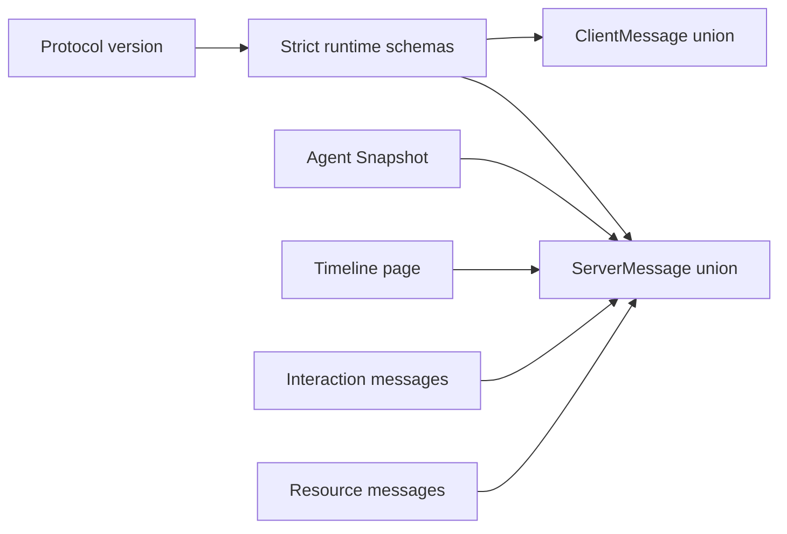
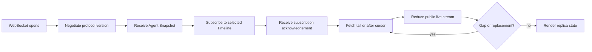

# Agent Remote Protocol — Strict Public Remote Contract

## Role

`@agent-remote-controller/agent-remote-protocol` defines the versioned public messages exchanged by a Remote client and Relay; it is neither a Provider-native event model nor the Relay's internal manager bus (`packages/agent-remote-protocol/src/messages.ts:150-176`, `packages/agent-remote-relay/src/agent-manager-events.ts:14-39`).

## Boundary

The package owns `protocolVersion`, strict runtime schemas, client/server message unions, Agent Snapshot, Timeline page, interactions, and resources (`packages/agent-remote-protocol/src/version.ts:3-10`, `packages/agent-remote-protocol/src/messages.ts:22-176`).

Independently versioned Agent and Remote Host uplink envelopes carry registration, request correlation, and virtual browser streams between a plugin and the standalone Node broker. Public protocol JSON stays an opaque string inside either transport envelope; the uplink does not redefine or normalize public content (`packages/agent-remote-protocol/src/uplink.ts:5-40`, `packages/agent-remote-protocol/src/remote-host-uplink.ts:18-40`).

## Collaborators

| Module | Direction | Responsibility |
| --- | --- | --- |
| Provider SDK | Provider SDK → Protocol | Supplies TypeScript values that Relay translates before they cross the public boundary. |
| Relay | Relay → Protocol | Decodes client input and encodes only the declared ServerMessage union. |
| Web | Protocol → Web | Supplies the sole values that the headless replica and React DOM client reduce. |

## Internal Architecture

The public union is an explicit composition of independently strict schemas, so a Relay cannot expose an internal `AgentManagerEvent` merely because it has a related shape (`packages/agent-remote-protocol/src/messages.ts:150-176`).

## Key Flows

The wire requires negotiation before an attached session sends its Snapshot, and it serializes Timeline subscription acknowledgement before queued Timeline delivery (`packages/agent-remote-relay/src/session-wire.ts:74-109`, `packages/agent-remote-relay/src/session-wire.ts:142-153`).

## Invariants

- Protocol negotiation requires exactly version `1.4.0`; planning controls and completed interaction history belong to this public contract rather than an implicit fallback (`packages/agent-remote-protocol/src/version.ts:3-6`, `packages/agent-remote-protocol/src/messages.ts:74-82`, `packages/agent-remote-protocol/src/timeline.ts:54`).
- Planning is an optional capability with an explicit creation preference and authoritative runtime state; clients cannot infer planning support or activity from permission settings or a command acknowledgement (`packages/agent-remote-protocol/src/snapshot.ts:19-55`, `packages/agent-remote-protocol/src/messages.ts:71-87`, `packages/agent-remote-protocol/src/messages.ts:124-135`).
- `AgentSnapshot` contains current Agent state and pending interactions, not Timeline entries (`packages/agent-remote-protocol/src/snapshot.ts:47-72`).
- Timeline recovery uses `timeline_page` with an epoch and cursors; a stale or forward cursor is represented explicitly rather than inferred from Snapshot (`packages/agent-remote-protocol/src/history.ts:13-48`, `packages/agent-remote-relay/src/timeline-projector.ts:50-88`).
- Interaction requests and responses have closed, kind-specific structures (`packages/agent-remote-protocol/src/interactions.ts:22-134`).
- Plan rejection may carry feedback; approval responses cannot carry rejection feedback, and completed interaction rows retain the typed request and response for Timeline recovery (`packages/agent-remote-protocol/src/interactions.ts:87-109`, `packages/agent-remote-protocol/src/timeline.ts:54`).
- Public resource bindings expose a visible locator, resource ID, and lifecycle state; Provider read identities are absent from the schema (`packages/agent-remote-protocol/src/resources.ts:22-30`).
- Available resource metadata and byte responses can carry `imageDimensions` with positive integer `width` and `height`. Local resource resolution returns optional `state` metadata without content bytes, allowing an authenticated client to reserve image space before requesting the payload (`packages/agent-remote-protocol/src/resources.ts`).
- Uplink envelopes reject undeclared fields, unsupported transport versions, invalid response statuses, and invalid stream-close values without parsing their nested public JSON. Remote Host catalog reads, including a current native-session summary, carry neither a binding target nor a request body; content reads and mutations retain their binding target (`packages/agent-remote-protocol/src/uplink.ts:42-69`, `packages/agent-remote-protocol/src/remote-host-uplink.ts:59-73`).
- Remote Host uplink version 2 accepts either the legacy single DSH registration or a nonempty unique Provider descriptor list. The broker catalog reports every descriptor under its Host and retains `providerId` only for single-Provider compatibility. Create and attach controls carry the selected `providerId`; native child attachment uses its distinct route. Public session protocol stays at `1.4.0` (`packages/agent-remote-protocol/src/remote-host-uplink.ts`, `packages/agent-remote-lab/src/server/remote-host-broker.ts`).
- Every uplink version 2 `registered` message includes `heartbeat: { intervalMs, timeoutMs }`. Both values are positive integers bounded at 600,000 milliseconds, with `timeoutMs < intervalMs`. Relay `heartbeat` and Controller `heartbeat_ack` frames carry the same nonempty nonce of at most 128 characters. These frames remain outside the public session protocol (`packages/agent-remote-protocol/src/remote-host-uplink.ts`).

## Non-Goals

- The package does not interpret Provider-native values or own Relay-internal manager events; those values enter only through Relay mapping into the declared public message union (`packages/agent-remote-protocol/src/messages.ts:150-176`, `packages/agent-remote-relay/src/session-wire.ts:208-311`).

## See also

- [Agent Remote](README.md) — the area boundary that composes this public contract.
- [Relay](relay.md) — the owner that maps internal manager events to this wire.
- [Web](web.md) — the public-wire consumer.

## Implementation Anchors

- `packages/agent-remote-protocol/src/messages.ts:22-176`
- `packages/agent-remote-protocol/src/snapshot.ts:47-72`
- `packages/agent-remote-protocol/src/history.ts:13-48`
- `packages/agent-remote-protocol/src/interactions.ts:22-134`
- `packages/agent-remote-protocol/src/resources.ts:22-94`
- `packages/agent-remote-protocol/src/uplink.ts:5-69`
- `packages/agent-remote-protocol/src/remote-host-uplink.ts:18-76`

Generic tool details may carry one inline `sessionReference` or a list of `sessionReferences`, each containing a native session ID and display title. These are navigation identities, not URLs or attachment permissions; clients resolve them within the current Host, Provider, and native session family. Multi-target references are available on running items as well as completed items and history.

## Tool results

Protocol `1.2.0` adds optional `tool_call.result`. A result contains ordered text or JSON content blocks, optional `exitCode` and `durationMs`, and an explicit `truncated` flag. Text may identify `stdout`, `stderr`, or combined output; absent stream metadata stays unspecified. Missing results mean the Provider supplied no result, while an empty content array explicitly represents an available result with no body. Results are complete snapshots attached to the existing `callId`, not append-only output chunks. Relay and client lifecycle projection replace the result along with the call state, and history/replay use the same representation (`packages/agent-provider-sdk/src/tool-result.ts`, `packages/agent-remote-protocol/src/tool-result.ts`, `packages/agent-remote-relay/src/timeline-projector.ts`).

Adapters bound result bodies to 65,536 characters across at most 128 blocks. Oversized JSON becomes a text preview and marks the result truncated. This preview does not expose a full-result download endpoint. Protocol negotiation remains exact: clients and Hosts using earlier protocol versions must update together with the Relay; transport uplink versions are unchanged.

## Typed interaction capabilities

Protocol `1.3.0` adds `form`, `permission_approval`, and `external_action`. Forms carry typed fields and stable field IDs; permission requests carry the exact resources and allowed durations; external actions separate opening an HTTP(S) link from explicitly confirming completion. Tool approvals can declare native cancellation and named policy choices. Capability flags are optional and absent flags mean unsupported (`packages/agent-remote-protocol/src/interactions.ts`, `packages/agent-remote-protocol/src/snapshot.ts`).

Sensitive question answers and form fields travel to the Provider only in the response command. Completed events and history carry `redacted` or `redactedFields` markers instead of those values. Sensitive field defaults are removed from public requests. Historical redaction markers are not valid new responses. Form `required` means property presence; nonempty strings and arrays require explicit minimum constraints. SDK request-aware validation additionally enforces choices, required values, form constraints, and exact permission scopes; structural wire decoding alone cannot authorize a response (`packages/agent-provider-sdk/src/interactions.ts`, `packages/agent-remote-relay/src/agent-manager.ts`). All endpoints must upgrade together because negotiation remains exact; uplink envelope versions do not change.

## Session settings

The unshipped protocol `1.4.0` includes optional `sessionSettings` capability, typed selection descriptors in `runtimeInfo.settings`, and `set_session_setting { requestId, agentId, settingId, value }`. Choice IDs are opaque Provider values, not native RPC method names. The existing `command_acknowledged`, runtime stream and Agent Snapshot carry completion and confirmed state. The independent uplink envelope versions stay unchanged. All public protocol participants must upgrade together because negotiation and object schemas are strict (`packages/agent-remote-protocol/src/session-settings.ts`, `packages/agent-remote-protocol/src/messages.ts`).

## Provider commands

The same unshipped `1.4.0` contract adds optional `commands` capability and Provider-owned descriptors containing opaque `id`, slash-free `name`, `description`, `kind` (`command`, `skill`, or `prompt`), and optional `inputHint`, `shortDescription`, and `documentation` resource binding. Names and IDs are unique within a directory. Native operation names and payloads remain private to adapters (`packages/agent-remote-protocol/src/commands.ts`, `packages/agent-provider-sdk/src/commands.ts`).

| Request | Matching reply | Payload |
| --- | --- | --- |
| `list_commands` | `command_list` | Request: `requestId`, `agentId`. Reply: the same IDs and `commands`. |
| `execute_command` | `command_result` | Request: `requestId`, `agentId`, `commandId`, `args`. Reply: the same IDs and `result`. |

Each pair has one correlated reply and no additional `command_acknowledged`. Native failures use the existing error response. `result` contains optional `text`; an empty result can mean a native menu was opened and does not assert completion of its remaining interactions. Existing `question` and `form` requests, interaction responses, and resolved events carry subsequent selections. No public message type is added per menu level. Session-setting toolbar writes still use their existing acknowledgement and confirmed runtime state. Exact version negotiation and independent uplink envelope versions remain unchanged (`packages/agent-remote-protocol/src/messages.ts`, `packages/agent-remote-relay/src/session-wire.ts`).

## Message delivery

The unshipped `1.4.0` send contract accepts optional `delivery: "immediate" | "next_turn"` on `send_message`. Omission means immediate input: the Provider starts idle work or steers active work using its native state. `next_turn` explicitly requests the native follow-up queue and requires optional `queueMessage` capability. Both use the existing `send_message` acknowledgement, which confirms native acceptance rather than message consumption or turn completion. Strict `steer` remains available to automation. No Remote-owned message queue or new message type is introduced (`packages/agent-provider-sdk/src/provider.ts`, `packages/agent-remote-protocol/src/messages.ts`, `packages/agent-remote-protocol/src/snapshot.ts`).

Command documentation reuses `ResourceBinding` and `resource_request` / `resource_response`; the command directory does not inline Markdown or native metadata. An unrequested documentation binding is pending. The Relay resolves Provider-owned locators to session-bound resource IDs and materializes documentation on demand. Skill tags and the open detail panel are local client state and introduce no wire operation.

## Native child relationships

The unshipped `1.4.0` contract includes optional `runtimeInfo.childSessions`, a direct-child relationship summary carried by the existing runtime event and Snapshot. Each entry identifies a native child with title, optional role/task description, stable creation or first-discovery time, native status, and observation mode. Optional `parentTurnId` and `parentCallId` preserve creation provenance; subsequent send/wait activity does not change it. Missing provenance is not inferred from adjacent assistant text. The SDK and public strict schema share this shape (`packages/agent-provider-sdk/src/observation.ts`, `packages/agent-remote-protocol/src/snapshot.ts`).

Child metadata does not contain nested transcripts, native control parameters, or a second interaction protocol. An opened child uses normal Agent identity, Snapshot, Timeline, resources, interactions, and commands. Runtime updates refresh the Relay's capability snapshot from the attached native session, so changed native input permissions propagate through `agent_update` and reconnect snapshots. Parent relationship status does not replace the child's authoritative turn state.
