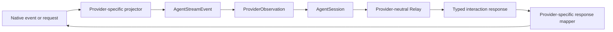
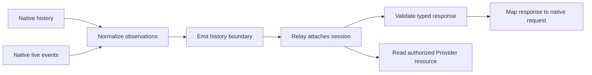

# Agent Remote Providers — Replaceable Native Adapters

## Role

The Provider layer terminates Provider-native protocols and exposes the common Agent Remote session contract; it is the only layer that interprets DSH or Codex event names (`packages/agent-provider-sdk/src/provider.ts:17-53`, `packages/agent-provider-sdk/src/observation.ts:53-84`).

## Boundary

`@borgee/agent-provider-sdk` owns the adapter/Session contract and `AgentStreamEvent`; `@borgee/agent-provider-dsh` and `@borgee/agent-provider-codex` own their native projection, response mapping, and runtime lifecycle (`packages/agent-provider-sdk/src/provider.ts:4-58`, `packages/agent-provider-dsh/src/index.ts:1-20`, `packages/agent-provider-codex/src/index.ts:1-6`).

## Collaborators

| Module | Direction | Responsibility |
| --- | --- | --- |
| Native DSH or Codex runtime | Native runtime → Provider adapter | Produces native history, live notifications, and native interaction requests. |
| Provider SDK | Provider SDK → Adapter | Requires session lifecycle, observation, capability, control, and resource-reader shapes. |
| Relay | Provider adapter → Relay | Consumes `ProviderObservation` and creates/resumes provider sessions without interpreting native protocol values. |
| Lab | Lab → Provider adapter | Selects compatible adapters and verifies the declared version before construction. |

## Internal Architecture

The adapter may carry provider-private resource read identities inside `ProviderObservation`, but its public event is always `AgentStreamEvent` (`packages/agent-provider-sdk/src/observation.ts:53-84`).

## Key Flows

Relay delays readiness until it observes the single history boundary, buffers earlier live observations, and rejects history after that boundary; adapters therefore provide the history/live distinction rather than requiring Relay to identify native records (`packages/agent-remote-relay/src/agent-manager.ts:250-279`).

## Codex process and native directory

The default local workbench composes the real Codex Provider, Recorded, and the DSH Host broker. Codex owns one app-server child per open session, receives JSONL events over stdio, and retains a bounded stderr tail for exit diagnostics. It uses the selected native home and login. Discovery uses `thread/list` for up to 500 recent unarchived root threads; selection resumes the original ID and hydrates `thread/read` history. Newly created unpersisted threads remain in memory until attached, and server shutdown disposes those children. `turn/steer` and `turn/interrupt` target the current native turn ID; the public schema is unchanged (`packages/agent-provider-codex/src/catalog.ts`, `packages/agent-provider-codex/src/session.ts`, `packages/agent-remote-lab/src/server/codex-directory.ts`, `packages/agent-remote-lab/src/server/local.ts`).

## Invariants

- A native event unknown to an adapter cannot silently become a public wire value; supported meaning is normalized or a visible diagnostic is emitted, while known DSH bookkeeping and Codex transport, metadata, telemetry, or side-channel notifications without independent Timeline meaning are consumed before the public boundary (`packages/agent-provider-codex/src/projector.ts:25-140`, `packages/agent-provider-dsh/src/projector.ts:79-106`).
- DSH model retry scheduling and attempt-start records are consumed as native bookkeeping, so a recoverable request failure does not become a conversation error. The owning turn's terminal outcome still determines completed, cancelled, or failed state (`packages/agent-provider-dsh/src/projector.ts:93-94`, `packages/agent-provider-dsh/src/projector.ts:149-165`).
- A DSH interaction enters the common contract only when its complete request or response shape is valid; malformed native interaction observations become visible Timeline diagnostics instead of partially typed events (`packages/agent-provider-dsh/src/projector.ts:354-370`, `packages/agent-provider-dsh/src/projector.ts:423-529`).
- Only a DSH `user/message` whose source kind is `user` becomes a human-authored Timeline item; tool, plugin, skill-catalog, and agent-instructions context is omitted, while other injected source kinds remain visible as unsupported diagnostics until the common contract has an injected-message item (`packages/agent-provider-dsh/src/projector.ts:166-186`).
- Unexpected native termination or native sequence discontinuity fails the Provider observation iterator instead of completing it normally: Codex propagates its app-server termination into the session queue, and DSH propagates its live sequence failure into its observation queue. Both queues preserve FIFO delivery of observations accepted before the terminal failure and throw that failure on the next read after the accepted observations drain (`packages/agent-provider-codex/src/app-server-transport.ts:68-89`, `packages/agent-provider-codex/src/app-server-transport.ts:152-162`, `packages/agent-provider-codex/src/session.ts:286-301`, `packages/agent-provider-codex/src/session.ts:389-418`, `packages/agent-provider-dsh/src/live-session.ts:21-66`, `packages/agent-provider-dsh/src/live-session.ts:222-275`).
- `AgentSession.capabilities` declares optional controls and resource reading; Relay rejects an unavailable optional command before calling native code, while a discovered resource without a Provider reader settles as a Relay-managed unavailable state (`packages/agent-provider-sdk/src/provider.ts:4-58`, `packages/agent-remote-relay/src/agent-manager.ts:195-212`, `packages/agent-remote-relay/src/resources/resource-ingestor.ts:132-148`).
- DSH resource reads are scoped to a successful session-owned write revision and return an unavailable state after the reader is stopped (`packages/agent-provider-dsh/src/generated-resource.ts:26-74`).
- Codex creates or resumes a real `codex app-server` session and maps native question/tool-approval requests into typed interactions; a completed native plan becomes a plan-approval request when the session has discovered a supported planning/default collaboration pair (`packages/agent-provider-codex/src/provider.ts:37-68`, `packages/agent-provider-codex/src/session.ts:279-298`, `packages/agent-provider-codex/src/session.ts:355-379`).
- Planning is independent of sandbox and tool-approval policy. DSH delegates it to the composed native plan-mode service and preserves both applied and requested state; Codex discovers native collaboration modes before claiming planning control. Explicit planning creation fails when unavailable, while an ordinary session does not require that capability (`packages/agent-provider-dsh/src/runtime.ts:140-158`, `packages/agent-provider-dsh/src/runtime.ts:409-432`, `packages/agent-provider-codex/src/planning.ts:15-30`, `packages/agent-provider-codex/src/session.ts:186-214`).
- Providers reject planning changes while native work or an interaction is pending. DSH maps review feedback into the original native request, allowing its suspended tool to continue; Codex owns the single follow-up turn after approval or a rejection with revision feedback, preserving a retryable review when native start is rejected and treating observed native work as authoritative acceptance (`packages/agent-provider-dsh/src/runtime.ts:423-432`, `packages/agent-provider-dsh/src/runtime.ts:328-350`, `packages/agent-provider-codex/src/session.ts:399-437`).
- A DSH Web composition keeps the native API proxy as the sole Question and Approval owner. The shared adapter observes its interaction stream and accepted answers from either Web or Lab, records complete normalized interactions in a session-scoped in-memory journal, and rejects further Lab answers if synchronization fails; standalone runtimes own their native interaction handlers directly (`packages/agent-provider-dsh/src/web-interactions.ts:46-230`, `packages/agent-provider-dsh/src/runtime.ts:225-258`).
- DSH history hydration interleaves the interaction journal with native history by observation time, preserving native sequence and journal order when timestamps tie or regress (`packages/agent-provider-dsh/src/runtime.ts:415-423`, `packages/agent-provider-dsh/src/runtime.ts:586-603`).
- A borrowed live DSH Agent is observed through the same Provider session contract without claiming ownership of its native handle. Closing the borrowed Provider session stops its observer but does not flush or dispose the native session (`packages/agent-provider-dsh/src/runtime.ts:176-179`, `packages/agent-provider-dsh/src/live-session.ts:205-225`).
- Native DSH single-select questions accept either an option or custom text. The shared adapter encodes a combined public answer as custom text containing both values and preserves its original structured response only when that same native submission is accepted. Plan revision feedback uses a custom-only native answer; a competing Web answer keeps its own response (`packages/agent-provider-dsh/src/web-interactions.ts:67-125`, `packages/agent-provider-dsh/src/web-interactions.ts:268-295`).

## Non-Goals

- The SDK is not a universal native-event ontology or a public wire schema; its Timeline values are event-specific strings and typed tool or task structures (`packages/agent-provider-sdk/src/observation.ts:3-76`).
- The adapter layer does not own public-wire encoding or browser projection; its session contract stays above the Relay and Web package boundaries (`packages/agent-provider-sdk/src/provider.ts:4-58`, `packages/agent-remote-relay/src/agent-manager.ts:71-180`, `packages/agent-remote-web/src/headless.ts:1-7`).
- An injected-message representation and general Codex filesystem access are not claimed. Codex thread names remain native metadata, and terminal-interaction activity remains a command side channel until the common Snapshot and tool detail gain matching state; the exact limitations are declared in the compatibility manifest (`packages/agent-remote-lab/compatibility.json:28-94`).

## Current vs Target

1. **Historical DSH generated-resource hydration is bounded to Lab-sized corpora.** `DshGeneratedResourceReader` scans the full observation history for each resource read, while Relay requests acquisition for each Timeline resource locator; N historical writes can therefore cause O(N²) reconstruction. The current adapter is not a production long-history hydration design; start at `packages/agent-provider-dsh/src/generated-resource.ts` and `packages/agent-remote-relay/src/agent-manager.ts` before widening this boundary (`packages/agent-provider-dsh/src/generated-resource.ts:36-73`, `packages/agent-remote-relay/src/agent-manager.ts:322-336`).

2. **Typed interaction history is retained only while the Relay/Provider process survives.** Native cold resume reconstructs ordinary Timeline items but does not reconstruct completed Question and Approval request/response records; the shared DSH Web interaction journal is in-memory only. Browser reload can read the live Relay history, while native process restart retains this limitation (`packages/agent-provider-dsh/src/web-interactions.ts:49-55`, `packages/agent-provider-dsh/src/runtime.ts:417-421`, `packages/agent-provider-codex/src/session.ts:133-146`, `packages/agent-provider-codex/src/history.ts:10-28`).

## See also

- [Agent Remote](README.md) — the generic downstream boundary.
- [Protocol](protocol.md) — the strict public schema that is distinct from this SDK.
- [Relay](relay.md) — the consumer of Provider sessions and observations.
- [Lab](lab.md) — the compatibility-checked validation composition.

## Implementation Anchors

- `packages/agent-provider-sdk/src/provider.ts:4-58`
- `packages/agent-provider-sdk/src/observation.ts:53-84`
- `packages/agent-provider-dsh/src/live-session.ts:21-275`
- `packages/agent-provider-dsh/src/live-provider.ts:15-59`
- `packages/agent-provider-dsh/src/web-interactions.ts:1-328`
- `packages/agent-provider-dsh/src/generated-resource.ts:18-130`
- `packages/agent-provider-codex/src/provider.ts:21-82`
- `packages/agent-provider-codex/src/app-server-transport.ts:41-162`
- `packages/agent-provider-codex/src/session.ts:66-418`

## Tool result mapping

Both adapters attach bounded result snapshots to the same tool call ID. Codex maps command `aggregatedOutput` as combined text and preserves native exit code and duration, MCP text and structured content, file change records including diffs, and available web-search actions and result records. New Codex threads request `historyMode: "paginated"` so native storage retains tool records across process restarts. Live completed items and `thread/read` history use the same mapping. Imported legacy threads retain their native history mode; tool records omitted by their native history API cannot be recovered by this adapter. Output delta notifications are not streamed into the public result; the completed item is authoritative (`packages/agent-provider-codex/src/tool-result.ts`).

DSH retains the nested content of `tool/result` messages and optional presentation metadata. Text stays text; JSON and unrecognized native content blocks remain JSON. The adapter does not parse exit codes or split stdout/stderr from human-readable output, because DSH's session event does not guarantee those structured fields. Failed calls retain their output in addition to the error (`packages/agent-provider-dsh/src/tool-result.ts`).

## Native interaction and image adaptation

Codex maps MCP elicitation into typed forms or external actions, and permission RPCs into exact filesystem/network approval requests. It retains original native grants and policy decisions in the pending request closure; UI labels never determine the native response. Unsupported form constraints are explicitly declined instead of dropped. Sensitive defaults are rejected, and sensitive submitted answers are omitted from normalized receipts. Tool approval buttons follow native `availableDecisions`, including policy amendments and cancellation (`packages/agent-provider-codex/src/elicitation.ts`, `packages/agent-provider-codex/src/permissions.ts`, `packages/agent-provider-codex/src/tool-approval.ts`, `packages/agent-provider-codex/src/session.ts`).

DSH continues to expose its native question, plan, and tool services. The shared response validator rejects historical redaction markers and the adapter rejects unsupported new kinds or tool scopes. The SDK union does not imply that DSH implements MCP forms, URL elicitation, or Codex permission policies (`packages/agent-provider-dsh/src/runtime.ts`).

Completed Codex `imageView` and `imageGeneration` items become Assistant Markdown plus opaque resource references. Live and historical projection share a session registry; clients submit resource IDs, never arbitrary native paths. Reads accept bounded PNG/JPEG/GIF/WebP bytes from explicitly referenced native files or embedded data, freeze the first result, and do not fetch URLs. A missing native file remains unavailable. Parent subagent tools expose lifecycle and result summaries without exposing child session routing (`packages/agent-provider-codex/src/images.ts`, `packages/agent-provider-codex/src/projector.ts`, `packages/agent-provider-codex/src/tool-result.ts`).

Synthesized plan approval state remains process-local. Browser reload recovers it from a living Relay; restarting the Host cannot reliably distinguish reviewed and pending historical plans. Cold resume does not infer approval state from the last plan item or replay uncertain commands.
