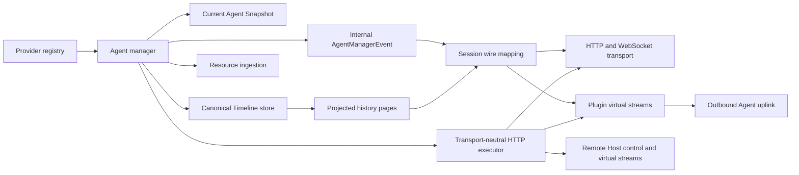
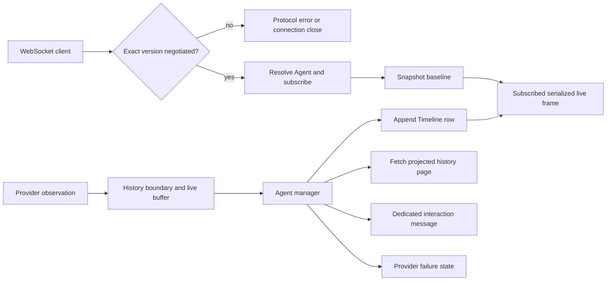

# Relay — Serialized Remote Session Owner

## Role

`@borgee/agent-remote-relay` owns Provider session attachment, current Agent state, ordered canonical Timeline rows, resource ingestion, and public transport composition. Its state engine can run inside a plugin without opening a listener (`packages/agent-remote-relay/src/agent-manager.ts:71-180`, `packages/agent-remote-relay/src/timeline-store.ts:29-68`, `packages/agent-remote-relay/src/transport/plugin-host.ts:36-43`).

## Boundary

The package owns `AgentRemoteRelay`, `AgentManager`, Timeline storage/projection, resource storage interfaces, and the HTTP/WebSocket server factory; it receives Provider adapters through the Provider SDK and maps internal manager events through the remote protocol package (`packages/agent-remote-relay/src/relay.ts:15-27`, `packages/agent-remote-relay/src/agent-manager-events.ts:14-39`).

## Collaborators

| Module | Direction | Responsibility |
| --- | --- | --- |
| Provider SDK | Provider SDK → Relay | Supplies Provider descriptors, sessions, history/live observations, capabilities, and typed controls. |
| Remote protocol | Relay → Remote protocol | Validates serialized request/response schemas and carries only mapped public messages. |
| Web client and Lab | Relay → Web client and Lab | Delivers Snapshots, projected Timeline pages, dedicated interactions, resources, and subscribed live frames. |
| Go broker | Relay → Go broker | Carries Agent or Remote Host uplink responses and independent browser streams after the broker establishes product authorization. |

## Internal Architecture

The relay preserves Provider-neutral boundaries: Provider-native interpretation never enters Relay ownership, and the session wire maps its internal `AgentManagerEvent` values to protocol-encoded messages (`packages/agent-remote-relay/src/session-wire.ts:282-379`).

An attached WebSocket remains protocol-only until exact negotiation succeeds. The session wire then resolves the Agent, subscribes before reading its Snapshot baseline, and bounds manager-event retention during both Snapshot handoff and Timeline-subscription acknowledgement (`packages/agent-remote-relay/src/session-wire.ts:40-69`, `packages/agent-remote-relay/src/session-wire.ts:85-115`, `packages/agent-remote-relay/src/session-wire.ts:217-267`).

Host composition may inject one request access policy for the complete Node HTTP and WebSocket ingress surface. It runs before route decoding and fails closed when the host rejects or throws; the WebSocket principal and per-operation authorizer remain independent requirements. The Relay owns enforcement, while the composing host owns credential meaning (`packages/agent-remote-relay/src/transport/request-access-policy.ts:1-17`, `packages/agent-remote-relay/src/transport/http-router.ts:30-43`, `packages/agent-remote-relay/src/transport/websocket-stream.ts:47-110`).

Node HTTP and the outbound plugin share a socket-free request executor, preserving public codecs and response semantics. Each plugin browser stream owns its own session wire and bounded receive chain; the standalone Node broker supplies authenticated routing while content state remains in the plugin's Relay (`packages/agent-remote-relay/src/transport/http-executor.ts:47-72`, `packages/agent-remote-relay/src/transport/plugin-host.ts:82-117`).

## Key Flows

## Invariants

- A relay session becomes visible only after its Provider history boundary is ready; live observations before it remain buffered (`packages/agent-remote-relay/src/agent-manager.ts:250-279`).
- Resume reattaches a Relay-owned session when the complete persistence handle matches, preserving its Agent identity, epoch, history, and native owner. The response identity is authoritative; the requested Agent identity is a candidate for a cold restore and cannot replace another Agent (`packages/agent-remote-relay/src/relay.ts:93-126`).
- Concurrent cold restores of the same complete persistence handle share one Provider attachment. Failed restores release their reservation for retry, and a restore that completes after Relay closure is disposed before it can become visible (`packages/agent-remote-relay/src/relay.ts:101-150`).
- A Provider observation iterator that fails or finishes while its manager remains open settles as failed Agent/runtime state and emits a `provider_observation_failed` diagnostic; explicit manager close is not reclassified as a Provider failure (`packages/agent-remote-relay/src/agent-manager.ts:238-312`).
- A Provider session that fails attachment is disposed, and a closed manager disposes its owned session before settling its observer (`packages/agent-remote-relay/src/agent-manager.ts:151-171`, `packages/agent-remote-relay/src/agent-manager.ts:238-247`).
- An interaction response may reach a Provider only while the matching request is pending; a concurrent duplicate is claimed before the native call and released only if that call fails (`packages/agent-remote-relay/src/agent-manager.ts:214-232`).
- Planning changes and message submission share one command queue; a planning change requires an idle Agent with no active turn or pending interaction, and publishes Provider runtime state only after the native change completes (`packages/agent-remote-relay/src/agent-manager.ts:198-241`).
- Explicit planning creation fails and disposes the created session when its capabilities cannot honor that request (`packages/agent-remote-relay/src/agent-manager.ts:150-158`).
- A normalized interaction resolution creates a completed Timeline row only when a matching pending request of the same kind exists; native completion owns pending removal, while history/live deduplication prevents duplicate completed rows (`packages/agent-remote-relay/src/agent-manager.ts:351-359`, `packages/agent-remote-relay/src/agent-manager.ts:408-440`, `packages/agent-remote-relay/src/agent-manager.ts:489-503`).
- Snapshot state is reduced separately from Timeline rows; projected history is fetched from the ordered Relay-owned Timeline store (`packages/agent-remote-relay/src/agent-manager.ts:307-380`, `packages/agent-remote-relay/src/timeline-projector.ts:50-120`).
- Backward Timeline pagination selects a projected entry by its first contributing sequence, so an entry remains reachable when later lifecycle updates cross the page cursor (`packages/agent-remote-relay/src/timeline-projector.ts:77-88`).
- Forward Timeline pagination bounds a page by raw sequences before projection, and its cursors and newer-history flag advance only through that raw window, so a coalesced lifecycle entry cannot skip unseen rows (`packages/agent-remote-relay/src/timeline-projector.ts:89-107`, `packages/agent-remote-relay/src/timeline-projector.ts:110-140`).
- Resource bytes are requested by Agent/resource identity; a composed session wire may authorize that request before delegating it, while bindings and lifecycle changes remain public metadata (`packages/agent-remote-relay/src/session-wire.ts:34-42`, `packages/agent-remote-relay/src/session-wire.ts:164-179`, `packages/agent-remote-relay/src/resources/resource-ingestor.ts:88-204`).
- The attached-session wire resolves and subscribes to no Agent before successful exact-version negotiation; its handoff queues have one configured bound, and either overflow or manager-event delivery failure unsubscribes the listener and closes the transport. WebSocket transport preserves retry-later semantics for overflow and uses internal-error semantics for delivery failure without exposing the underlying error (`packages/agent-remote-relay/src/session-wire.ts:40-94`, `packages/agent-remote-relay/src/session-wire.ts:228-280`, `packages/agent-remote-relay/src/transport/websocket-stream.ts:105-145`).
- The attached-session wire emits strict protocol errors for malformed input and unavailable commands (`packages/agent-remote-relay/src/session-wire.ts:85-121`, `packages/agent-remote-relay/src/session-wire.ts:128-214`).
- The Lab creates its HTTP/WebSocket server through exported Relay APIs rather than a Relay-internal transport seam (`packages/agent-remote-lab/src/server.ts:1-23`).
- An uplink binds one Agent, rejects foreign Agent requests and native-session import, and bounds outstanding requests and browser streams (`packages/agent-remote-relay/src/transport/plugin-host.ts:40-45`, `packages/agent-remote-relay/src/transport/plugin-host.ts:120-154`, `packages/agent-remote-relay/src/transport/plugin-host.ts:156-179`).
- An uplink disconnect closes virtual wires and retires response delivery while preserving the Relay and native sessions; reconnection registers again without replaying dispatched operations (`packages/agent-remote-relay/src/transport/plugin-host.ts:48-55`, `packages/agent-remote-relay/src/transport/uplink-client.ts:53-83`).
- Remote Host virtual streams resolve an opaque binding supplied by the product broker. Catalog and creation control are kept outside public Relay routes, while Provider, Snapshot, and Timeline requests resolve only after that binding is available (`packages/agent-remote-relay/src/transport/remote-host-plugin.ts:20-22`, `packages/agent-remote-relay/src/transport/remote-host-plugin.ts:105-157`).
- The independent Agent Host retains Provider directories, request reservations, native sessions, and Relay projections across uplink replacement. A broker restart requires a new temporary key and `agent-host pair`; reconnect does not retry uncertain creation or control requests and preserves the canonical native-to-Relay identity (`packages/agent-host/src/host.ts`, `packages/agent-host/src/directory.ts`).
- Outbound transport queues have message-count, byte, and write-deadline bounds; exhaustion retires the connection instead of silently dropping a public message (`packages/agent-remote-relay/src/transport/uplink-writer.ts:40-76`).

## Non-Goals

- The Relay does not import a Provider-native SDK or projector (`packages/agent-remote-relay/src/agent-manager.ts:1-24`, `packages/agent-remote-relay/src/relay.ts:1-13`).
- The standalone store is injected and in-memory by default; it does not decide product authorization, retention, garbage collection, or deployment topology (`packages/agent-remote-relay/src/relay.ts:23-27`, `packages/agent-remote-relay/src/resources/resource-store.ts:34-94`).

## See also

- [Agent Remote](README.md) — area boundary and related modules.
- [Protocol](protocol.md) — strict public wire that this package maps to.
- [Providers](providers.md) — native interpretation that remains above the Relay boundary.
- [Web](web.md) — browser consumer of the serialized relay boundary.

## Implementation Anchors

- `packages/agent-remote-relay/src/relay.ts:15-27`
- `packages/agent-remote-relay/src/agent-manager.ts:71-380`
- `packages/agent-remote-relay/src/agent-manager-events.ts:14-39`
- `packages/agent-remote-relay/src/timeline-store.ts:29-68`
- `packages/agent-remote-relay/src/timeline-projector.ts:21-120`
- `packages/agent-remote-relay/src/session-wire.ts:40-379`
- `packages/agent-remote-relay/src/transport/http-executor.ts:36-118`
- `packages/agent-remote-relay/src/transport/plugin-host.ts:36-184`
- `packages/agent-remote-relay/src/transport/uplink-client.ts:25-125`
- `packages/agent-remote-relay/src/transport/remote-host-plugin.ts:20-184`
- `packages/agent-remote-relay/src/transport/remote-host-uplink-client.ts:14-145`
- `packages/agent-remote-relay/src/transport/uplink-writer.ts:12-78`

## Interaction response boundaries

Before invoking a Provider, the manager validates each response against the pending request and claims that request for a single responder. Native failure releases the claim for deliberate retry. Native resolutions and hydrated completed interaction rows pass through request-aware redaction before reaching public events or history, including records supplied by a Provider that did not redact its own receipt (`packages/agent-remote-relay/src/agent-manager.ts`, `packages/agent-provider-sdk/src/interactions.ts`).

## Session setting selection

`setSessionSetting` shares the existing command serialization with message and planning operations. It checks capability, idle status, active turn, pending interactions and the latest advertised mutable choice before invoking the Provider. On completion it reads fresh native runtime state and publishes the Snapshot update before command acknowledgement. The wire rejects foreign Agent identities and preserves native errors as operation failures (`packages/agent-remote-relay/src/agent-manager.ts`, `packages/agent-remote-relay/src/session-wire.ts`).

## Provider command routing

`listCommands` checks the optional Provider capability and validates unique opaque IDs and names in the returned directory. `executeCommand` shares serialization with message, planning, and session-setting operations, reads a fresh directory, rejects an unavailable command ID, and forwards the untouched argument string to the Provider. The Provider owns native availability and busy-state checks. Successful execution refreshes runtime state before returning the result; it can still leave a pending native menu interaction (`packages/agent-remote-relay/src/agent-manager.ts`, `packages/agent-provider-sdk/src/commands.ts`).

The session wire returns `command_list` for `list_commands` and `command_result` for `execute_command`, preserving `requestId` and the bound `agentId`. Neither path sends an extra `command_acknowledged`; wrong-Agent requests, missing capabilities, and native failures use the existing error path. Command-owned questions and forms enter the same pending-interaction state and response validation as other Provider requests. Interaction responses remain outside the command queue so a command waiting on user input can continue (`packages/agent-remote-relay/src/session-wire.ts`, `packages/agent-remote-relay/src/agent-manager.ts`).

Message delivery intent passes unchanged through the existing send operation. Relay rejects `next_turn` without `queueMessage` capability before calling native code. Once a native command execution has been accepted, immediate and next-turn sends fail promptly until it settles, including when the command itself is waiting behind another control operation. This prevents a long native command from implicitly retaining later user messages in the control serialization chain. Cancellation and interaction responses remain independent (`packages/agent-remote-relay/src/agent-manager.ts`, `packages/agent-remote-relay/src/session-wire.ts`).

Command descriptors can expose a short description and an optional Provider-owned documentation locator. The Relay binds that locator to a session-specific resource ID without reading content during discovery. A resource request revalidates the current directory, acquires the document through the Provider reader and existing resource ingestion checks, and responds under the advertised resource ID. Removed commands and unregistered resource IDs are unavailable; documentation reads do not enter the command execution queue (`packages/agent-remote-relay/src/agent-manager.ts`).

Runtime updates retain native child relationship summaries and refresh the session capability snapshot before publishing `agent_update`. Child observations use separate AgentManagers and the ordinary session wire, so their Timeline and pending interaction identities remain isolated. A parent summary is not a copy of its children's pending requests.
