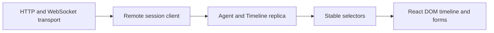
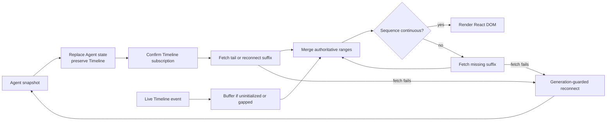

# Web — Recoverable Public-Wire Projection

## Role

`@borgee/agent-remote-web` provides a browser transport client, a headless Agent/Timeline replica, and React DOM renderers that project strict public remote-protocol values without Provider-specific code (`packages/agent-remote-web/src/client/remote-session-client.ts:20-224`, `packages/agent-remote-web/src/react/AgentTimeline.tsx:25-69`).

## Boundary

The package owns public-wire decoding, subscription catch-up, Timeline recovery, Agent and interaction reduction, correlated public operations, read-only protocol observation, resource lifecycle/authorized response state, selectors, and reusable React components; the Relay owns authoritative remote state and Provider adapters remain outside this boundary (`packages/agent-remote-web/src/client/transport.ts:21-62`, `packages/agent-remote-web/src/client/remote-session-client.ts:103-417`, `packages/agent-remote-web/src/replica/store.ts:27-89`).

## Collaborators

| Module | Direction | Responsibility |
| --- | --- | --- |
| Remote relay | Relay → Web | Supplies serialized Agent snapshots, Timeline pages, interaction and resource state, and live events. |
| Remote protocol | Remote protocol → Web | Defines every value decoded, reduced, sent, and rendered across the package boundary. |
| Workbench and embedding surfaces | Web → Lab and product surfaces | Supplies headless state, React DOM renderers, conversation controls, and scroll anchoring; hosts own layout, transport credentials, and account lifetime. |
| Terminal debugger | Web → Debugger | Supplies the same transport, session client, and Replica used by the browser projection. |

## Internal Architecture

The replica has no React dependency; the timeline receives replica state and callbacks instead of opening network connections (`packages/agent-remote-web/src/headless.ts:1-7`, `packages/agent-remote-web/src/react/AgentTimeline.tsx:16-69`). The React entry point is the DOM composition boundary: it exports composable timeline, item, resource, and interaction components, while headless consumers import the transport and replica surface without React (`packages/agent-remote-web/src/react.ts:1-30`, `packages/agent-remote-web/src/headless.ts:1-7`).

Timeline composition first derives a pure render model from the current epoch and projected entries, then gives each item to an explicit type renderer; resource and interaction cards remain reusable components receiving state and callbacks from their host (`packages/agent-remote-web/src/react/timeline-render-model.ts:11-53`, `packages/agent-remote-web/src/react/TimelineItemRenderer.tsx:11-26`, `packages/agent-remote-web/src/react/AgentTimeline.tsx:33-68`, `packages/agent-remote-web/src/react/ResourceList.tsx:7-51`, `packages/agent-remote-web/src/react/InteractionPanel.tsx:11-66`).

Conversation composition remains independent of product navigation and authentication. The shared composer accepts host-controlled text or retains per-session drafts internally; planning uses confirmed public runtime state, and scrolling anchors to public Timeline entry identities. Hosts may supply reading-position memory to restore a loaded entry across route remounts and temporary reconnect views. An optional host-owned continuity identity retains follow intent and the last valid scroll position across an epoch replacement, so a reader stays above while entry anchors always remain epoch-specific (`packages/agent-remote-web/src/react/AgentComposer.tsx:21`, `packages/agent-remote-web/src/react/AgentPlanningControl.tsx:11`, `packages/agent-remote-web/src/react/useTimelineScroll.ts:7`).

## Key Flows

## Invariants

- Agent Snapshot replacement never clears the independently paged Timeline (`packages/agent-remote-web/src/replica/reducer.ts:75-99`).
- Subscription confirmation starts tail or reconnect-suffix catch-up; a live Timeline event is buffered only while its Timeline is uninitialized or it is ahead of the next expected sequence, and a contiguous event can apply while catch-up is in flight (`packages/agent-remote-web/src/client/remote-session-client.ts:174-196`, `packages/agent-remote-web/src/client/remote-session-client.ts:226-301`, `packages/agent-remote-web/src/replica/reducer.ts:233-265`).
- An `after` catch-up keeps one recovery controller, follows each advancing page-end cursor while newer history remains, and becomes ready only after the terminal page; a missing, cross-epoch, or non-advancing continuation enters recoverable reconnection instead of spinning (`packages/agent-remote-web/src/client/remote-session-client.ts:247-301`).
- Duplicate sequence delivery leaves the replica unchanged, while a forward gap holds later events until an `after` page fills the missing range (`packages/agent-remote-web/src/replica/reducer.ts:233-260`, `packages/agent-remote-web/src/client/remote-session-client.ts:235-245`).
- Authoritative page ranges replace overlapping live projections, so live-before-fetch and history-before-live orders converge (`packages/agent-remote-web/src/replica/reducer.ts:191-230`, `packages/agent-remote-web/src/replica/reducer.ts:323-435`).
- A Timeline replacement retires the old epoch and clears its entries atomically; later delivery from a retired epoch cannot mutate the replica (`packages/agent-remote-web/src/replica/reducer.ts:158-175`, `packages/agent-remote-web/src/replica/reducer.ts:233-252`).
- Only the current client generation and recovery controller may commit a catch-up page; Timeline replacement retires the active recovery before starting its replacement fetch (`packages/agent-remote-web/src/client/remote-session-client.ts:43-95`, `packages/agent-remote-web/src/client/remote-session-client.ts:190-194`, `packages/agent-remote-web/src/client/remote-session-client.ts:247-301`).
- A failed Timeline catch-up records a recoverable diagnostic and queues a fresh connection through the generation guard; explicit `stop()` retires that generation, aborts recovery, and prevents the queued restart from reconnecting (`packages/agent-remote-web/src/client/remote-session-client.ts:60-95`, `packages/agent-remote-web/src/client/remote-session-client.ts:247-306`, `packages/agent-remote-web/src/client/remote-session-client.ts:405-417`).
- Before a recovery restart replaces its active connection, the session client rejects every operation owned by that connection rather than leaving acknowledgement promises alive until their timers (`packages/agent-remote-web/src/client/remote-session-client.ts:60-69`, `packages/agent-remote-web/src/client/remote-session-client.ts:303-306`, `packages/agent-remote-web/src/client/remote-session-client.ts:359-390`).
- Interaction changes newer than a Snapshot request baseline win over that Snapshot, preventing a late response from reopening a resolved request or hiding a new one (`packages/agent-remote-web/src/replica/reducer.ts:75-99`, `packages/agent-remote-web/src/replica/reducer.ts:177-189`).
- Row-scoped resource binding replacements update the matching current-epoch Timeline sequence, including a buffered live row, while pushed lifecycle metadata advances every matching binding and resource record to its terminal state (`packages/agent-remote-web/src/replica/reducer.ts:101-156`).
- Resource bytes enter the replica only through a separately requested response; React components expose pending, available, failed, or unavailable metadata without executing resource content or polling for settlement (`packages/agent-remote-web/src/client/remote-session-client.ts:154-160`, `packages/agent-remote-web/src/react/ResourceList.tsx:13-51`, `packages/agent-remote-web/src/react/ResourceCard.tsx:26-52`).
- The timeline render model groups only adjacent user or adjacent assistant messages; another item or a different message kind starts a new visual group (`packages/agent-remote-web/src/react/timeline-render-model.ts:22-32`).
- Timeline error diagnostics render as neutral, initially collapsed runtime notices with a compact preview and an accessible toggle for the complete text. They do not assert that the Agent failed; actual failure remains represented by the existing failed runtime state and the host's failure alert (`packages/agent-remote-web/src/react/items/ErrorItem.tsx:1`, `packages/agent-remote-lab/src/components/LabWorkbench.tsx:35`).
- A rendered entry key includes its Timeline epoch, provider, first sequence, and item identity, so an epoch replacement receives a distinct React key while an extension of the same projected entry retains its key. The same identity is exposed on the DOM entry for host-owned scroll anchoring; hosts may suppress the default header without replacing the shared timeline (`packages/agent-remote-web/src/react/timeline-render-model.ts:35-48`, `packages/agent-remote-web/src/react/AgentTimeline.tsx:25-59`).
- Earlier pages use a separate, deduplicated request from live catch-up and do not change connection readiness. Failures remain local to history loading; invalid or retired pages cannot clear the loaded conversation. Stopping or replacing the connection aborts the older-page request.
- Earlier-history feedback belongs to the current Agent and epoch, suppresses overlapping activation, and awaits the host callback; a rejection keeps retry available and cannot surface in a replacement history control (`packages/agent-remote-web/src/react/AgentTimeline.tsx:47-50`, `packages/agent-remote-web/src/react/AgentTimeline.tsx:72-102`).
- Tool details are locally disclosed while their name, semantic summary, status, and failure remain visible; disclosure follows the enclosing entry identity through same-entry updates (`packages/agent-remote-web/src/react/items/ToolCallItem.tsx:8-42`, `packages/agent-remote-web/src/react/AgentTimeline.tsx:55-59`).
- Shared Markdown rendering turns CommonMark and GFM into React elements, preserving authored line breaks and keeping footnote navigation within its message. Tables use keyboard-accessible horizontal scroll regions; raw HTML remains text, image references remain inert alternative text, and links retain the renderer's URL allowlist (`packages/agent-remote-web/src/react/MarkdownContent.tsx:11-44`, `packages/agent-remote-web/src/styles.css:92-120`).
- Question drafts use stable question IDs and structured option values, and a host may retain the controlled draft outside the rendered card. Question navigation changes presentation without changing answer identity (`packages/agent-remote-web/src/react/interactions/QuestionCard.tsx:4`, `packages/agent-remote-web/src/react/AgentTimeline.tsx:25`).
- Interaction submission locks the form until the request leaves pending Replica state; a rejected host operation restores editing and preserves answers or revision feedback. A plan rejection carries feedback, while approval invokes only the interaction callback (`packages/agent-remote-web/src/react/InteractionPanel.tsx:23`, `packages/agent-remote-web/src/react/interactions/PlanApprovalCard.tsx:13`).
- Completed interaction entries render read-only questions, answers, plans, and decisions from their canonical request and response. Pending forms are composed separately from these durable Timeline records (`packages/agent-remote-web/src/react/items/InteractionItem.tsx:9`, `packages/agent-remote-web/src/react/AgentTimeline.tsx:66`).
- Completed questions keep recorded selections and custom answers visible in a compact summary; local disclosure reveals the original prompts through the shared safe Markdown renderer. Missing answers and dismissal remain explicit without reopening an interaction (`packages/agent-remote-web/src/react/items/CompletedQuestionItem.tsx:11`).
- Correlated command, interaction, and resource operations resolve only from their matching public response; transport observation publishes only validated inbound and successfully sent outbound messages, and an observer failure cannot change transport delivery (`packages/agent-remote-web/src/client/remote-session-client.ts:110-223`, `packages/agent-remote-web/src/client/remote-session-client.ts:314-403`, `packages/agent-remote-web/src/client/http-websocket-transport.ts:166-191`, `packages/agent-remote-web/src/client/http-websocket-transport.ts:325-342`).
- The headless exports import only public remote-protocol values and have no React dependency (`packages/agent-remote-web/src/headless.ts:1-7`).

- Composer submission excludes IME confirmation and Shift+Enter, preserves failed text, and clears only the submitted draft after acknowledgement. A host can disable remote operations without changing the public capability declaration (`packages/agent-remote-web/src/react/AgentComposer.tsx:58`).
- Optional history prefetch starts on upward wheel, touch, keyboard, or scrollbar intent within the larger of 600 pixels and 1.5 viewport heights from the top. It shares manual loading, attempts each cursor once automatically, and never starts merely because the initial page is short.
- Scroll following pauses on upward reading intent and history loading; prepended content preserves the visible entry and offset. An identity replacement resumes following by default, while a host continuity identity preserves that intent and the last valid scroll position without carrying an entry key across epochs. Scroll events and layout restoration share the same return-to-latest visibility rule, and unchanged visibility does not schedule another render (`packages/agent-remote-web/src/react/useTimelineScroll.ts:24`).

## Non-Goals

- The package does not own or inspect a Provider runtime, Provider SDK value, Relay-internal event, or product layout (`packages/agent-remote-web/src/client/remote-session-client.ts:1-16`, `packages/agent-remote-web/src/react/AgentTimeline.tsx:16-32`).
- The package does not require React Native, Expo, or a product application shell (`packages/agent-remote-web/package.json:1-34`).

## See also

- [Agent Remote](README.md) — overall boundary and documentation map.
- [Protocol](protocol.md) — public messages reduced in this package.
- [Debugger](debugger.md) — terminal presentation adapter that uses the headless client.
- [Lab](lab.md) — composition that uses this package without duplicating it.

## Implementation Anchors

- `packages/agent-remote-web/src/client/http-websocket-transport.ts:1-364`
- `packages/agent-remote-web/src/client/remote-session-client.ts:20-424`
- `packages/agent-remote-web/src/replica/store.ts:27-89`
- `packages/agent-remote-web/src/replica/reducer.ts:75-260`
- `packages/agent-remote-web/src/react/AgentTimeline.tsx:16-102`
- `packages/agent-remote-web/src/react/items/ToolCallItem.tsx:8-60`
- `packages/agent-remote-web/src/react/MarkdownContent.tsx:11-44`
- `packages/agent-remote-web/src/react/interactions/QuestionCard.tsx:4`
- `packages/agent-remote-web/src/react/interactions/PlanApprovalCard.tsx:13`
- `packages/agent-remote-web/src/react/items/InteractionItem.tsx:9`
- `packages/agent-remote-web/src/react/items/CompletedQuestionItem.tsx:11`
- `packages/agent-remote-web/src/react/timeline-render-model.ts:11-53`
- `packages/agent-remote-web/src/react/TimelineItemRenderer.tsx:11-26`
- `packages/agent-remote-web/src/react.ts:1-30`

- `packages/agent-remote-web/src/react/AgentComposer.tsx:21`
- `packages/agent-remote-web/src/react/AgentPlanningControl.tsx:11`
- `packages/agent-remote-web/src/react/useTimelineScroll.ts:5`

## Tool result disclosure

The existing tool row remains compact. Expanding it shows the call details followed by result text/JSON, available exit code and duration, and a truncation notice when needed. Result bodies render as escaped plain text rather than HTML, inside a bounded scroll area. The disclosure state survives updates to the same tool call. A completed tool result is also retained in the headless replica used by the terminal debugger (`packages/agent-remote-web/src/react/items/ToolResultView.tsx`, `packages/agent-remote-web/src/react/items/ToolCallItem.tsx`).

## Extended interaction controls

The interaction panel renders typed forms, permission approvals, and external actions alongside questions, plans, and tool approvals. Form submissions preserve typed numbers, booleans, and selections; a rejected submission retains the draft, and offline forms stay mounted with disabled controls. Sensitive text fields use password inputs and completed receipts hide sensitive values defensively. Permission scope and tool policy buttons come only from the request. External links require explicit navigation, and opening a link does not complete the request (`packages/agent-remote-web/src/react/interactions`, `packages/agent-remote-web/src/react/items/InteractionReceipt.tsx`).

The session client rejects responses to requests no longer in the replica's pending list, preventing a delayed resolution from acknowledging a new stale submission. Relay validation remains authoritative for competing clients. Outbound protocol observation redacts free-form interaction answers while the real command retains its payload; observers receive a detached copy marked `redacted` (`packages/agent-remote-web/src/client/remote-session-client.ts`, `packages/agent-remote-web/src/client/http-websocket-transport.ts`).

## Chat session controls

The composer fetches the selected Provider's directory when the slash menu opens, filters its names, and displays loading, retryable failure, unavailable-capability, and empty-result states. Menu rows show a name and one description line with a trailing fade; optional short descriptions take precedence. Skill and prompt labels distinguish entry kinds without grouping or changing native order. Arrow keys, Enter, and Tab select entries, and Escape dismisses the menu. Submission sends the opaque command ID and preserves arguments; unknown slash input stays in the draft and never reaches the model. Session identity and request-generation guards prevent a stale directory or completion from changing another session's UI (`packages/agent-remote-web/src/react/AgentComposer.tsx`, `packages/agent-remote-web/src/react/useAgentCommands.ts`).

The client correlates `list_commands` with `command_list` and `execute_command` with `command_result`; neither operation waits for an additional acknowledgement. Optional result text appears as command feedback. An empty result may leave a question or form pending, and native multi-step menus continue through the existing interaction panel and response path. The UI interprets Provider descriptors and interaction types, without native RPC names or a fixed `/status` / `/help` directory (`packages/agent-remote-web/src/client/remote-session-client.ts`, `packages/agent-remote-web/src/react/InteractionPanel.tsx`).

The toolbar retains model, permission, and status shortcuts backed by runtime state and shared setting panels. Native updates remain authoritative, duplicate submissions are disabled, and disconnected or busy sessions retain readable values while restricting mutation. Native command entries may differ from toolbar controls and between Providers (`packages/agent-remote-web/src/react/AgentSessionSettings.tsx`, `packages/agent-remote-web/src/react/AgentComposer.tsx`).

Native command execution waits for its correlated result, error, or connection closure without the short timeout used by ordinary acknowledgement operations. Pending questions remain answerable during execution. The composer exposes Interrupt for an in-flight native command even when it has no active turn; cancellation acknowledgement leaves the command pending until the native operation settles. A separate `Executing command` label describes this local request state. Native `Working` and elapsed time derive from the Agent runtime and active turn timestamp, recover from snapshots, and stop presenting live activity on disconnection (`packages/agent-remote-web/src/client/remote-session-client.ts`, `packages/agent-remote-web/src/react/AgentComposer.tsx`, `packages/agent-remote-web/src/react/AgentActivityStatus.tsx`).

The composer has one ordinary send action. Enter and the send button request immediate delivery in both idle and busy states; native state selection belongs to the Provider. A busy session advertising `queueMessage` also exposes **Queue for next turn**, which sends `delivery: "next_turn"`. The browser does not hold messages for later execution. Queue submission uses the same duplicate prevention, failure draft retention, and acknowledgement feedback as ordinary send. Tab keeps its browser focus behavior outside the slash menu (`packages/agent-remote-web/src/react/AgentComposer.tsx`).

Skill selection is a local draft operation: clicking, Enter, or Tab stages one removable skill tag and never executes it. A later send invokes its opaque command ID with the exact draft text. Failure retains both the text and tag; successful execution clears only the submitted session draft. Skills cannot be invoked or queued during native work because the current command execution contract requires idle state. Ordinary native control commands retain their existing menu behavior.

Clicking a skill tag opens `AgentCommandDetails`. The Lab hosts this component beside the conversation, with an overlay on narrow screens; other composer hosts can supply `onInspectCommand` or use the inline detail fallback. The details component shows the full description immediately, requests optional documentation through the existing resource callback, and renders inert Markdown with loading, retry, and unavailable states. Escape closes the panel and focus returns to the originating control. Documentation loading never executes the command (`packages/agent-remote-web/src/react/AgentCommandDetails.tsx`, `packages/agent-remote-lab/src/components/LabWorkbench.tsx`).

## Child rows under parent replies

The Timeline renders direct native children below the final assistant entry in their originating parent turn. Each child appears once, ordered by creation or first-discovery time; status changes do not reorder it. Missing or not-yet-rendered origin turns use a separately labeled conversation-level list. Child rows expose title, supporting role/task information and status, and invoke a caller-owned navigation callback. The Web renderer does not parse native Codex events or create sessions itself.

The composer accepts an optional `sessionControls` slot for additional controls inside the Status panel. Session menus close on outside pointer interaction or Escape, which returns focus to the trigger. The slot stays mounted while hidden so pending provider changes survive menu navigation (`packages/agent-remote-web/src/react/AgentComposer.tsx`, `packages/agent-remote-web/src/react/AgentSessionSettings.tsx`).

The shared composer accepts caller-owned `consoleCommands`, `onExecuteConsoleCommand` and `attachments`. Console commands remain distinct from native capabilities and carry a Console label; their names and aliases take precedence in the local menu. Provider command discovery failures do not disable available console commands. Each mounted composer has distinct input, command-menu and accessibility IDs, allowing independent primary and side conversations without cross-target focus or labels.
